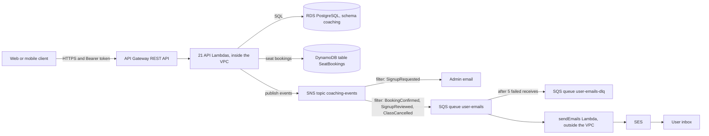
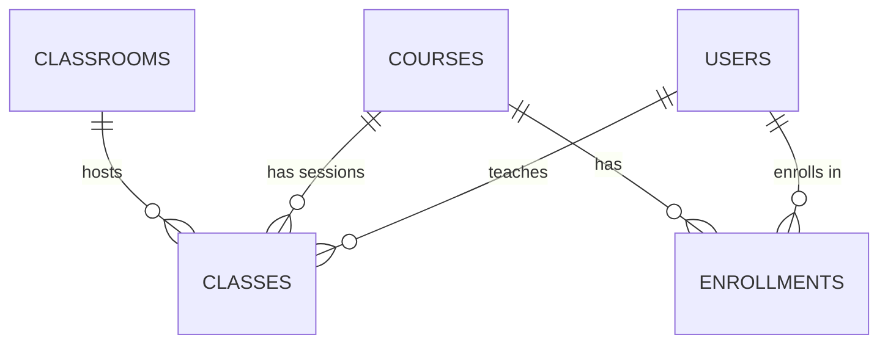
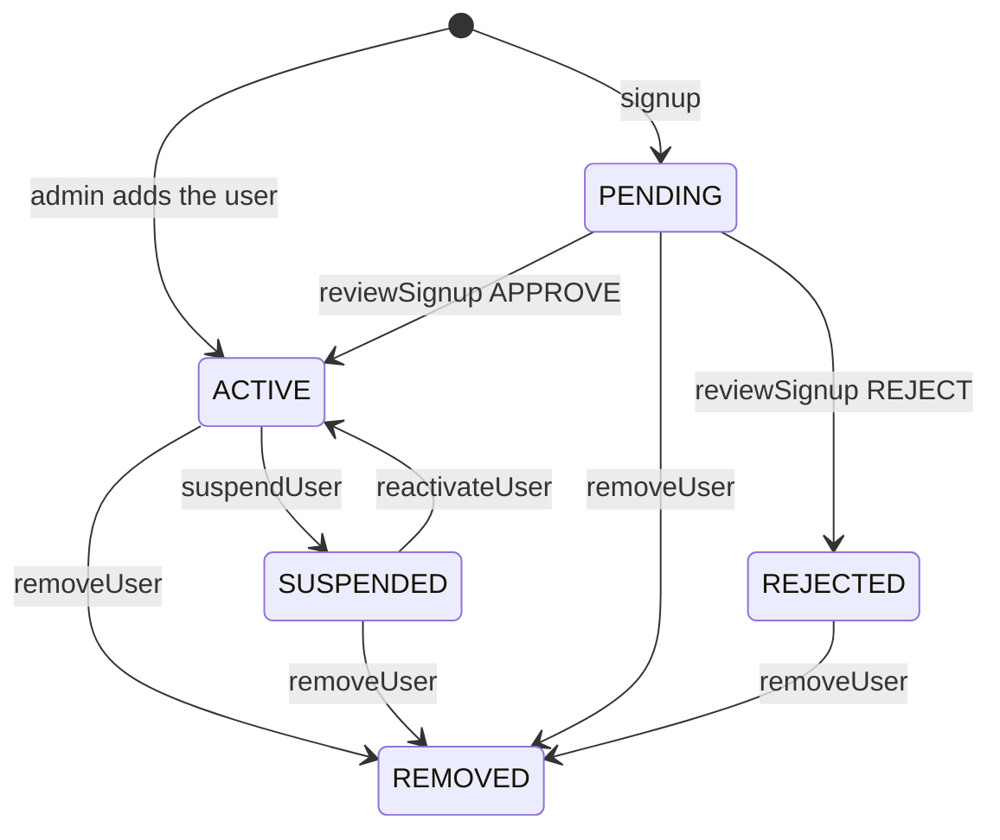

# Coaching Center Backend: Build Workbook

A step-by-step record of how this backend was designed and built on AWS. It is written so that you can rebuild it from scratch, change it, or debug it months from now without remembering anything.

Every service we used has its own section with four parts: **what it is**, **why we used it**, **exactly how it was set up**, and **how to check that it works**. The troubleshooting section lists every problem we actually hit while building this, with the cause and the fix.

> **How to use this workbook.** Read sections 1 to 4 once. After that, follow section 4 (the build-order checklist) from top to bottom, jumping into the linked service section for each step. Every service section ends with a "Verify" list. Do not move on until it passes.

## Table of contents

1. [Overview](#1-overview)
2. [Before you start](#2-before-you-start)
3. [Repository layout](#3-repository-layout)
4. [Build order checklist](#4-build-order-checklist)
5. [Services](#5-services)
   - [5.1 VPC and networking](#51-vpc-and-networking)
   - [5.2 RDS PostgreSQL](#52-rds-postgresql)
   - [5.3 Database schema, migrations and roles](#53-database-schema-migrations-and-roles)
   - [5.4 DynamoDB](#54-dynamodb)
   - [5.5 IAM](#55-iam)
   - [5.6 Lambda](#56-lambda)
   - [5.7 API Gateway](#57-api-gateway)
   - [5.8 SNS](#58-sns)
   - [5.9 SQS](#59-sqs)
   - [5.10 SES](#510-ses)
   - [5.11 CloudWatch](#511-cloudwatch)
   - [5.12 CloudShell and the AWS CLI](#512-cloudshell-and-the-aws-cli)
   - [5.13 EC2 (optional practice)](#513-ec2-optional-practice)
   - [5.14 Cost control](#514-cost-control)
6. [Application design](#6-application-design)
   - [6.1 Authentication and roles](#61-authentication-and-roles)
   - [6.2 Account lifecycle](#62-account-lifecycle)
   - [6.3 Booking a seat](#63-booking-a-seat)
   - [6.4 Cancellations](#64-cancellations)
   - [6.5 Event catalog](#65-event-catalog)
   - [6.6 The email pipeline](#66-the-email-pipeline)
7. [API reference](#7-api-reference)
8. [Testing](#8-testing)
9. [Troubleshooting](#9-troubleshooting)
10. [Operations](#10-operations)
11. [Limitations and roadmap](#11-limitations-and-roadmap)
12. [Appendix](#12-appendix)

---

## 1. Overview

### 1.1 What the system does

A backend for a coaching center where students book seats in classes.

- **Browse** courses, classrooms, teachers and classes. A student can start from a course, from a classroom, or from a teacher, and drill down to dates and then to the seat layout of one class, with booked seats marked.
- **Sign up and log in.** Students and teachers sign up and wait for an admin to approve them. An admin can also create teacher and student accounts directly. Login returns a token. Users can change their password.
- **Book a seat** in a class, and see **my bookings** on a dashboard.
- **Manage the catalog.** Admins and teachers add courses. Admins add classrooms.
- **Cancel and suspend.** Cancel a class or a whole course, and suspend, remove or reactivate a teacher or student account.
- **Emails.** Booking confirmations, signup decisions and class cancellations are emailed to students. The admin is notified of new signups.

### 1.2 Architecture



### 1.3 Services at a glance

| Service | Role in this system | What we created |
|---|---|---|
| **VPC** | Private network that holds the database and the API Lambdas | VPC endpoints for DynamoDB (gateway) and SNS (interface), security-group rules |
| **RDS PostgreSQL** | System of record for users, courses, classrooms, classes and enrollments | One instance, schema `coaching`, two database users |
| **DynamoDB** | Seat bookings, where fast, atomic "is this seat free" writes matter | Table `SeatBookings` and index `student-index` |
| **IAM** | Controls what each Lambda may touch | Custom policies, managed policies, one execution role per function |
| **Lambda** | Runs all the code (Node.js) | 22 functions from one zip |
| **API Gateway** | The public HTTPS front door | One REST API, stage `Development`, 21 routes, 31 models |
| **SNS** | Announces events ("a seat was booked") | Topic `coaching-events` and two subscriptions |
| **SQS** | Buffers email work so one failure doesn't block the others | Queues `user-emails` and `user-emails-dlq` |
| **SES** | Sends the emails | Verified sender (and test recipients while in the sandbox) |
| **CloudWatch** | Logs, metrics and alarms, used for all debugging | Log groups (automatic), recommended alarms |
| **CloudShell** | Browser terminal for AWS CLI and Python scripts | Nothing to create |
| **EC2** | Optional: practice and a jump host for the private database | Not required by the system |

### 1.4 How the main flows work

**Browse.** The client calls a list API (`/getCourses`, `/getClassrooms`, `/getTeachers`, `/getClasses`). Each accepts optional filters, so the same five APIs serve all three starting points. Finally `/getClassAvailability/{class_id}` returns the room layout from Postgres plus the booked seats from DynamoDB.

**Signup and approval.**
1. `POST /signup` creates a user with status `PENDING` and a hashed password. It publishes `SignupRequested`.
2. The admin lists `GET /pendingSignups` and calls `POST /reviewSignup` with `APPROVE` or `REJECT`. It publishes `SignupReviewed`.
3. Only `ACTIVE` accounts can log in.

**Booking.**
1. The student calls `POST /book` with a token. The student ID comes from the token, never from the request body.
2. The Lambda checks the class, room size and time in Postgres, then writes the booking to DynamoDB in one transaction that fails if the seat is taken or the student already has a seat in that class.
3. It publishes `BookingConfirmed`, which becomes an email.

**Notifications.** Lambdas publish events to SNS. SNS filters them into the `user-emails` queue. The `sendEmails` Lambda reads the queue and sends through SES. Failed messages are retried and then moved to the dead-letter queue.

**Cancellation.** `POST /cancelClass` (or `/cancelCourse`, or suspending a teacher) marks classes `CANCELLED` in Postgres, finds the students who had a seat in DynamoDB, and publishes one `ClassCancelled` event per affected booking.

---

## 2. Before you start

### 2.1 Accounts and tools

| You need | Used for |
|---|---|
| An AWS account and console access (an administrator user is simplest) | Everything |
| Region **us-east-2 (Ohio)** | Every resource must be in the same region. Tables, queues, topics and functions are regional. |
| **Node.js 20 or newer** and **npm** | Building the Lambda package |
| `zip` (built into macOS and Linux) | Packaging |
| A PostgreSQL client such as DBeaver, pgAdmin or `psql` | Running the SQL scripts |
| `curl` or **Postman** | Calling the API |
| **AWS CloudShell** (the terminal icon in the console) | AWS CLI commands and the `create_models.py` script |
| **git** and a GitHub account | Version control |

### 2.2 Placeholders used in this workbook

Replace these everywhere you see them. Never commit real values to GitHub.

| Placeholder | Meaning | Where to find it |
|---|---|---|
| `YOUR_ACCOUNT_ID` | Your 12-digit AWS account ID | Account menu, top right of the console |
| `YOUR_API_ID` | The REST API ID, the part before `.execute-api` in the invoke URL | API Gateway, then your API |
| `YOUR_RDS_ENDPOINT` | Hostname of the database | RDS, then your instance, then Connectivity and security |
| `your_db_name` | Name of the database inside the instance | RDS, then Configuration |
| `YOUR_VERIFIED_EMAIL` | An address verified in SES | SES, then Verified identities |
| `PASTE_ADMIN_TOKEN`, `PASTE_STUDENT_TOKEN` | The `token` value returned by `/login` | Run the `login` function |

### 2.3 Names used throughout

These names are used by the code or by each other. If you choose different names, change them everywhere.

| Thing | Name |
|---|---|
| AWS region | `us-east-2` |
| Database schema | `coaching` |
| Database users | `app_user` (read-only) and `app_writer` (writes and logins) |
| DynamoDB table | `SeatBookings` (partition key `class_id`, sort key `sk`, both String) |
| DynamoDB index | `student-index` (partition key `student_id`, sort key `booked_at`, both String) |
| SNS topic | `coaching-events` |
| SQS queues | `user-emails` and `user-emails-dlq` |
| API Gateway API and stage | `coaching` and `Development` |
| Custom IAM policies | `CoachingEventsPublish`, `CoachingBookingsQuery`, `CoachingBookingsDelete`, `CoachingBookingsWrite`, `CoachingSendEmail` |

Lambda function names are your choice, because the **handler** setting decides which code runs, not the name. In our build the first function was named `getCourses` but ran the `listCourses` handler. This workbook names each function after its handler file to keep things simple.

### 2.4 Safety first

Do this **before** creating anything else, so a forgotten resource can't surprise you. See [5.14 Cost control](#514-cost-control) for the steps: a monthly budget with an email alert.

---

## 3. Repository layout

```
coaching-api/
├── README.md                    short intro and quick start
├── WORKBOOK.md                  this file
├── .gitignore                   keeps node_modules, zips and secrets out of git
├── package.json                 dependencies (pg, jsonwebtoken) and the AWS SDK for local use
├── functions/                   one file per Lambda handler (22 files)
│   ├── listCourses.js           GET  /getCourses
│   ├── listClassrooms.js        GET  /getClassrooms
│   ├── listTeachers.js          GET  /getTeachers
│   ├── listClasses.js           GET  /getClasses
│   ├── getClassAvailability.js  GET  /getClassAvailability/{class_id}
│   ├── myBookings.js            GET  /myBookings
│   ├── signup.js                POST /signup
│   ├── login.js                 POST /login
│   ├── changePassword.js        POST /changePassword
│   ├── pendingSignups.js        GET  /pendingSignups
│   ├── reviewSignup.js          POST /reviewSignup
│   ├── addTeacher.js            POST /addTeacher
│   ├── addStudent.js            POST /addStudent
│   ├── addClassroom.js          POST /addClassroom
│   ├── addCourse.js             POST /addCourse
│   ├── book.js                  POST /book
│   ├── cancelClass.js           POST /cancelClass
│   ├── cancelCourse.js          POST /cancelCourse
│   ├── suspendUser.js           POST /suspendUser
│   ├── removeUser.js            POST /removeUser
│   ├── reactivateUser.js        POST /reactivateUser
│   └── sendEmails.js            SQS-triggered, no API route
├── shared/                      code imported by the handlers
│   ├── db.js                    PostgreSQL connection pool and query helper
│   ├── http.js                  response wrapper, error type, input validation
│   ├── auth.js                  JWT signing and role checks
│   ├── password.js              scrypt password hashing
│   ├── users.js                 user creation and validation
│   ├── events.js                publishes events to SNS
│   ├── bookings.js              DynamoDB helpers
│   ├── cancellations.js         cancels classes and notifies students
│   └── accounts.js              suspend, remove and reactivate logic
├── scripts/
│   └── hashPassword.js          prints a password hash (for the first admin)
├── sql/                         run in numeric order
│   ├── 01_schema.sql            tables and constraints
│   ├── 02_indexes.sql           indexes
│   ├── 03_seed.sql              sample data
│   ├── 04_auth_and_approval.sql ADMIN role, password hashes, approval status, app_writer
│   ├── 05_accounts_and_cancellations.sql  suspension, cancellation fields, course status
│   └── 06_read_only_role.sql    app_user
└── docs/
    ├── openapi.json             Swagger / OpenAPI 3 description of all 21 endpoints
    ├── models.json              the 31 API Gateway request and response models
    └── create_models.py         creates the models and attaches them to the API methods
```

**Never commit:** `node_modules/`, any `.zip`, `.env` files, JWT secrets, database passwords, access keys, or an exported `deployed.json` (it contains your account ID). The `.gitignore` already excludes these. See [10.5 Before you push to GitHub](#105-before-you-push-to-github).

---

## 4. Build order checklist

Do the steps in this order. Each depends on the ones above it. Tick the boxes as you go.

**Foundation**
- [ ] 1. Create a monthly **budget** with an email alert ([5.14](#514-cost-control)).
- [ ] 2. Confirm the **VPC** and note its ID, subnets and security groups ([5.1](#51-vpc-and-networking)).
- [ ] 3. Create the **RDS PostgreSQL** instance in that VPC ([5.2](#52-rds-postgresql)).
- [ ] 4. Run SQL scripts **01 to 06** in order, then create the **first admin** ([5.3](#53-database-schema-migrations-and-roles)).
- [ ] 5. Create the **DynamoDB** table, turn on TTL, and create the `student-index` index ([5.4](#54-dynamodb)).

**Code and permissions**
- [ ] 6. Build the **Lambda package**: `npm install --omit=dev`, then zip ([5.6.2](#562-build-the-deployment-package)).
- [ ] 7. Create the **custom IAM policies** ([5.5](#55-iam)).
- [ ] 8. Create the **Lambda functions**, with their handlers, memory, timeouts, environment variables and VPC settings ([5.6.3](#563-create-a-function)).
- [ ] 9. Attach the **IAM policies** to each function's role ([5.5.4](#554-which-function-gets-which-policy)).
- [ ] 10. Create the **DynamoDB gateway endpoint** in the VPC ([5.1.4](#514-vpc-endpoints)).

**API**
- [ ] 11. Create the **API Gateway** REST API, resources and methods, with Lambda proxy integration ([5.7](#57-api-gateway)).
- [ ] 12. Create the **models** and attach them (use `create_models.py`), then **deploy** to `Development`.
- [ ] 13. Run the **tests** in [section 8](#8-testing): signup, approval, login, browse, book, my bookings.

**Notifications (can be done later)**
- [ ] 14. Create the **SQS** queues ([5.9](#59-sqs)), the **SNS** topic and subscriptions ([5.8](#58-sns)), and verify **SES** identities ([5.10](#510-ses)).
- [ ] 15. Create the **SNS interface endpoint** in the VPC, then set `EVENTS_TOPIC_ARN` on the publishing functions.
- [ ] 16. Create the **`sendEmails`** function with its SQS trigger, and run the email tests ([8.4](#84-testing-the-email-pipeline)).

**Finish**
- [ ] 17. Add **CloudWatch alarms** ([5.11](#511-cloudwatch)).
- [ ] 18. **Export** the Swagger file and compare it with `docs/openapi.json` ([5.7.8](#578-export-the-swagger-file)).
- [ ] 19. Run the **pre-publish checklist** and push to GitHub ([10.5](#105-before-you-push-to-github)).

---

## 5. Services

Each section below follows the same pattern: what the service is, why we used it, how it was set up, and how to verify it.

### 5.1 VPC and networking

#### 5.1.1 What it is and why we used it

A **VPC** (Virtual Private Cloud) is a private network inside AWS. The database lives in it, and so do the API Lambdas, so that they can reach the database over private addresses without exposing it to the internet.

Two consequences shape the whole design:

1. **A Lambda inside a VPC has no internet access and no route to other AWS services by default.** To call DynamoDB or SNS it needs a **VPC endpoint** (or a NAT gateway, which costs more). This is the cause of the "function hangs until it times out" problems in [section 9](#9-troubleshooting).
2. **A Lambda that does not need the database should stay outside the VPC.** That is why `sendEmails` is not in the VPC: it needs only SQS and SES, so it needs no endpoint at all.

Our account had a single default VPC. The default VPC is fine for a practice project.

#### 5.1.2 Security groups

A **security group** is a firewall attached to a resource. Rules are about which other security group may connect, not about IP addresses, because Lambda's IP addresses change constantly.

**What we used:** the `default` security group on both the Lambdas and the RDS instance. The default group has a rule allowing all traffic between members of the same group, so the Lambdas can reach the database on port 5432. It works, but every resource in the VPC can reach every other.

**Cleaner setup (recommended next time):**

1. **EC2 → Security Groups → Create security group.** Name it `coaching-lambda-sg`, choose the VPC, and add no inbound rules. Leave the default outbound rule.
2. Open the **RDS instance's security group** and add an inbound rule: type **PostgreSQL**, port **5432**, source `coaching-lambda-sg` (choose the group, not an IP address).
3. Attach `coaching-lambda-sg` to every Lambda in the VPC.
4. If you also create the SNS interface endpoint ([5.1.4](#514-vpc-endpoints)), give that endpoint a security group that allows inbound **HTTPS (443)** from `coaching-lambda-sg`.

#### 5.1.3 Attaching a Lambda to the VPC

For each API function: **Lambda → the function → Configuration → VPC → Edit**.

- **VPC:** the same VPC as the RDS instance.
- **Subnets:** at least two, in different Availability Zones.
- **Security group:** as in 5.1.2.

The function's role needs the managed policy `AWSLambdaVPCAccessExecutionRole`. The console normally attaches it automatically when you save the VPC settings. See [5.5.3](#553-managed-policies) if it is missing.

The panel **Configuration → RDS databases** (with an "Add Proxy" and "Connect to RDS database" button) is a convenience wizard. **You do not need it.** The functions connect with the host, user and password in their environment variables.

#### 5.1.4 VPC endpoints

**DynamoDB gateway endpoint (free, required for any function that uses DynamoDB).**

1. **VPC → Endpoints → Create endpoint.** (Scroll the left menu if you can't see Endpoints, or start from the VPC dashboard.)
2. **Type:** AWS services. **Service:** `com.amazonaws.us-east-2.dynamodb`, the one whose type is **Gateway**.
3. **VPC:** the same VPC. **Route tables:** tick the route tables used by the Lambda subnets (ticking all of them is fine here).
4. **Policy:** full access. Create it and wait for **Available**.

Functions that need it: `getClassAvailability`, `book`, `myBookings`, `cancelClass`, `cancelCourse`, `suspendUser`, `removeUser`.

**SNS interface endpoint (costs money, only needed for notifications).**

1. **VPC → Endpoints → Create endpoint.** Service: `com.amazonaws.us-east-2.sns`, type **Interface**.
2. **VPC and subnets:** the same VPC and the subnets the Lambdas use.
3. **Enable private DNS: yes.** This makes the SDK's normal SNS address resolve to the private endpoint, so no code change is needed.
4. **Security group:** one that allows inbound **443** from the Lambdas' security group. The `default` group works because of its self-referencing rule.
5. Create it and wait for **Available**.

Functions that publish events: `signup`, `reviewSignup`, `book`, `cancelClass`, `cancelCourse`, `suspendUser`, `removeUser`.

**Cost.** An interface endpoint is billed per hour per Availability Zone plus a small data charge, roughly **$7 a month per AZ** at the time of writing. A NAT gateway is about **$32 a month plus data**. Gateway endpoints (DynamoDB, S3) are free. Check the AWS pricing pages for current numbers. For practice, create the SNS endpoint only while you are working on notifications, then **delete it**: billing stops when you delete it.

If a Lambda cannot reach SNS, the booking still succeeds (publishing is best-effort) and the log shows `publishEvent failed` after about 2 seconds.

#### 5.1.5 Reaching the database from your computer

Your SQL client runs outside the VPC, so it needs a path in. Pick one:

- **Public access (simplest for practice).** On the RDS instance set **Public access: Yes**, and add an inbound rule to the RDS security group for port 5432 from **your IP address only** (choose "My IP" in the console). **Never** use `0.0.0.0/0`. Your IP changes, so update the rule when you can't connect. A public instance also incurs a public IPv4 address charge.
- **Private instance with a jump host (better).** Keep public access off and launch a small EC2 instance in the same VPC. Connect through **SSM Session Manager port forwarding**, so no inbound rule from the internet is needed. See [5.13](#513-ec2-optional-practice).

The Lambdas never use this path. They connect over the VPC.

#### Verify

- [ ] The VPC ID, subnet IDs and security group IDs are written down.
- [ ] The RDS security group allows 5432 from the Lambda security group.
- [ ] The DynamoDB gateway endpoint is **Available** and lists the Lambda subnets' route tables.
- [ ] (Notifications only) the SNS interface endpoint is **Available** with private DNS enabled.

---

### 5.2 RDS PostgreSQL

#### 5.2.1 What it is and why we used it

**RDS** runs a managed PostgreSQL database. We use it for the data that is relational and must stay consistent: users, courses, classrooms, classes and enrollments. Postgres gives us foreign keys, check constraints and the exclusion constraints that stop a room or teacher being double-booked.

Seat bookings are deliberately **not** here. See [5.4](#54-dynamodb) for why.

#### 5.2.2 Create the instance

In our build the instance already existed, so these are recommended settings rather than a record of what we clicked.

**RDS → Create database:**

| Setting | Value | Reason |
|---|---|---|
| Creation method | Standard create | You see every option |
| Engine | PostgreSQL (15 or newer) | The scripts are plain PostgreSQL and need the `btree_gist` extension, which RDS supports |
| Template | Dev/Test (or Free tier if offered) | Cheapest while practicing |
| Instance class | A small burstable class such as `db.t4g.micro` or `db.t3.micro` | Plenty for this workload |
| Storage | 20 GB general purpose SSD | Enough, and it can grow |
| Initial database name | A name you choose (this is `your_db_name`) | If left blank, RDS creates no database |
| Master username and password | Choose a strong password and keep it in a password manager | Used only to run the SQL scripts |
| VPC | The same VPC as the Lambdas | They must reach it privately |
| Public access | No (or Yes with an IP rule, see 5.1.5) | Safer to keep it private |
| Security group | One that allows 5432 from the Lambda security group | See 5.1.2 |
| Backups | Keep the default retention | Cheap insurance |

Write down the **endpoint** (hostname) once the instance is **Available**. This is `YOUR_RDS_ENDPOINT`.

**Stop or delete the instance when you are not using it**: it bills by the hour whether or not anyone connects. A stopped instance restarts automatically after 7 days.

#### 5.2.3 Connect with a SQL client

Use host `YOUR_RDS_ENDPOINT`, port `5432`, database `your_db_name`, and the master username and password. Run the scripts as the master user, as described in [5.3](#53-database-schema-migrations-and-roles).

#### 5.2.4 What the Lambdas need

Each Lambda that uses the database gets these environment variables:

| Variable | Value |
|---|---|
| `DB_HOST` | `YOUR_RDS_ENDPOINT` |
| `DB_PORT` | `5432` |
| `DB_NAME` | `your_db_name` |
| `DB_USER` | `app_user` or `app_writer` (see 5.3.3) |
| `DB_PASSWORD` | that user's password |
| `APP_TIMEZONE` | for example `Asia/Kolkata` or `America/New_York` |

`shared/db.js` creates one connection pool per Lambda container with a maximum of **one** connection, so a burst of invocations can't exhaust the database. It sets the session's `search_path` to `coaching, public` and the time zone from `APP_TIMEZONE` when the connection starts.

**Use the same time zone** for the seed script session and for `APP_TIMEZONE`, or the dates shown by the API can shift.

**SSL.** `db.js` uses `ssl: { rejectUnauthorized: false }`, which encrypts the connection but does not verify the server's certificate. That is a practice shortcut. For production, load the RDS CA bundle and verify the certificate.

**Passwords.** Environment variables are fine for practice. Anyone with console access to a function can read them. Later, move the database password and `JWT_SECRET` to AWS Secrets Manager.

#### Verify

- [ ] The instance is **Available**.
- [ ] A SQL client can connect with the master user.
- [ ] The RDS security group allows 5432 from the Lambda security group.

---

### 5.3 Database schema, migrations and roles

#### 5.3.1 Design



| Table | Holds |
|---|---|
| `users` | Admins, teachers and students: name, email, role, password hash, approval/suspension status |
| `courses` | Course definitions, with a status (`ACTIVE` or `CANCELLED`) |
| `classrooms` | Rooms with `total_rows`, `total_columns` and a generated `capacity` |
| `classes` | One scheduled session: a course, a teacher, a room, start and end time, status |
| `enrollments` | Which students are enrolled in which courses (no API uses it yet) |

Design decisions worth remembering:

| Decision | Reason |
|---|---|
| Everything lives in the `coaching` schema | Keeps the tables out of `public` and makes permissions simple |
| `BIGINT GENERATED BY DEFAULT AS IDENTITY` keys | Modern auto-increment. "By default" lets the seed script supply explicit IDs |
| `TIMESTAMPTZ` for times | Stores an exact moment, independent of time zone |
| Seat bookings are not in Postgres | They are written in DynamoDB, where an atomic conditional write prevents double booking |
| Role is pinned with a composite foreign key | `users` has `UNIQUE (user_id, role)`, and `classes` stores `teacher_role = 'TEACHER'`, so the database rejects a student being assigned as a teacher |
| Exclusion constraints on `classes` | `no_classroom_overlap` and `no_teacher_overlap` stop double booking of rooms and teachers, and ignore `CANCELLED` classes. They need the `btree_gist` extension |
| `UNIQUE INDEX ON lower(email)` | `A@x.com` and `a@x.com` cannot both register |
| `capacity` is a generated column | Always equals rows times columns |
| Accounts are never deleted | Classes and history refer to them, so "remove" is a soft delete (`REMOVED`) |

#### 5.3.2 Run the scripts

Run these **in order**, as the master user, connected to `your_db_name`. Each script sets `search_path` itself, but the setting only lasts for the current session, so if your client opens a new connection per script, that is already handled.

| Script | What it does | Edit before running |
|---|---|---|
| `01_schema.sql` | Creates the extension, the `coaching` schema, and the five tables with constraints | nothing |
| `02_indexes.sql` | Creates indexes for schedule, teacher and course lookups | nothing |
| `03_seed.sql` | Inserts 5 teachers, 5 students, 3 courses, 10 classrooms, 40 classes, 10 enrollments | nothing (see the note on dates below) |
| `04_auth_and_approval.sql` | Adds the `ADMIN` role, `password_hash`, approval `status`, review columns, and creates the `app_writer` role | `your_db_name` and the `app_writer` password |
| `05_accounts_and_cancellations.sql` | Adds `SUSPENDED` and `REMOVED` states, cancellation audit fields, a course status, and column-level update rights for `app_writer` | nothing |
| `06_read_only_role.sql` | Creates the read-only `app_user` role | `your_db_name` and the `app_user` password |

**About the seed dates.** The seed classes are on 2026-10-05 to 2026-10-08. The list APIs only show classes that have not ended, so once those days pass the lists look empty. Either set the environment variable `SHOW_PAST=true` on the Lambdas while testing, or edit the dates in `03_seed.sql`.

**About time zones.** Seed times have no offset, so they are read in the session's time zone. Run `SET TIME ZONE 'your/zone';` first if it matters.

#### 5.3.3 Database users and what they can do

The Lambdas never connect as the master user. Two limited users give each function only what it needs.

| User | Used by | Can do |
|---|---|---|
| `app_user` | `listCourses`, `listClassrooms`, `listTeachers`, `listClasses`, `getClassAvailability`, `myBookings` | `SELECT` only |
| `app_writer` | Every other API Lambda (login, signup, admin, booking, cancel and so on) | `SELECT` on everything. `INSERT` into `users`, `courses`, `classrooms`. Column-level `UPDATE`: on `users` (`status`, `reviewed_by`, `reviewed_at`, `password_hash`, `status_reason`, `status_changed_at`, `status_changed_by`), on `classes` (`status`, `cancelled_at`, `cancelled_by`, `cancel_reason`), on `courses` (`status`) |

Because the update rights are per column, `app_writer` cannot change a user's role or email. A bug in a browse endpoint cannot write anything.

`06_read_only_role.sql` includes an **optional hardening** block (commented out) that hides email and password hash from `app_user`. The browse queries only read `user_id`, `name` and `role` from `users`.

To change a database user's password: `ALTER ROLE app_writer PASSWORD 'new-password';`, then update `DB_PASSWORD` on every function that uses it.

#### 5.3.4 Create the first admin

There is no API that creates an admin, on purpose. Create the first one directly:

1. On your computer, from the project folder, run `npm install` once, then:
   ```bash
   node scripts/hashPassword.js 'YourStrongPassword'
   ```
   It prints a hash that starts with `scrypt$`. The password never leaves your machine. (A password typed on a command line stays in your shell history, so choose one you will change after the first login.)
2. In the SQL client, run:
   ```sql
   INSERT INTO coaching.users (name, email, role, status, password_hash)
   VALUES ('Your Name', 'you@example.com', 'ADMIN', 'ACTIVE', 'PASTE_THE_HASH_HERE');
   ```

This is also the way to set a password for any other user directly: `UPDATE coaching.users SET password_hash = '...' WHERE user_id = 6;`

#### 5.3.5 Seed users and passwords

The seeded teachers and students (user IDs 1 to 10) have **no password**, so they cannot log in. That is intentional. To test as a student or teacher, either:

- create a new user with `POST /addStudent` or `POST /addTeacher` (as the admin), or `POST /signup` followed by an approval, or
- give a seed user a hash with the `UPDATE` above.

#### 5.3.6 Verify

Run these as the master user:

```sql
-- Five tables in the coaching schema
SELECT table_name FROM information_schema.tables WHERE table_schema = 'coaching' ORDER BY 1;

-- 40 classes with the seed data
SELECT count(*) FROM coaching.classes;

-- Users by role and status (seed users are ACTIVE after script 04)
SELECT role, status, count(*) FROM coaching.users GROUP BY 1, 2 ORDER BY 1, 2;

-- The exclusion constraints exist
SELECT conname FROM pg_constraint
 WHERE conrelid = 'coaching.classes'::regclass AND contype = 'x';
```

Then check the limited users by opening a **new connection** as each one:

```sql
-- As app_user: works
SELECT count(*) FROM coaching.classes;
-- As app_user: must fail with "permission denied"
DELETE FROM coaching.classes;
```

- [ ] The five tables exist.
- [ ] 40 classes, 10 users, 3 courses, 10 classrooms.
- [ ] `no_classroom_overlap` and `no_teacher_overlap` are listed.
- [ ] `app_user` can read but not delete. `app_writer` can read.
- [ ] The first admin row exists with status `ACTIVE`.

---

### 5.4 DynamoDB

#### 5.4.1 What it is and why we used it

**DynamoDB** is a managed key-value and document database. We use it only for **seat bookings**.

Why DynamoDB for bookings:

- **Atomic, conditional writes.** "Insert this seat only if nobody has it" is enforced by the database even when two students click at the same instant. Exactly one write wins.
- **One partition per class.** "All booked seats for class 42" is a single key lookup.
- **Pay per request.** On-demand mode needs no capacity planning and costs pennies at this scale.

An honest note for the future: at the size of a coaching center, PostgreSQL could handle bookings easily too, with one less service to run. We chose DynamoDB partly to learn it. The price is that foreign keys and the seat-in-room check no longer protect bookings, so the application code does those checks (see [6.3](#63-booking-a-seat)).

#### 5.4.2 Table design

| Setting | Value |
|---|---|
| Table name | `SeatBookings` |
| Partition key | `class_id` (**String**) |
| Sort key | `sk` (**String**) |
| Capacity mode | On-demand |
| TTL attribute | `expires_at` |

**Why `class_id` and nothing else in the key.** A `class_id` comes from Postgres, which is the source of truth, and it already identifies one exact session (course, room, date and time). We considered building the key from `room_no + date + course` supplied by the client, and rejected it: a wrong or stale value would silently point at an *empty* partition, the seat grid would look fully available, and the same seat could be booked twice under two different keys. The key must always be derived on the server from a verified record.

DynamoDB does not need a date in the key. A date can be stored as an ordinary attribute and indexed later if you want date queries.

**Two kinds of item share each class's partition:**

| Item | `class_id` | `sk` | Other attributes |
|---|---|---|---|
| **Seat** | `"42"` | `SEAT#R3#C4` | `student_id` (S), `row` (N), `col` (N), `booked_at` (S, ISO 8601 time), `expires_at` (N, epoch seconds) |
| **Student marker** | `"42"` | `STUDENT#12` | `seat_sk` (S), `expires_at` (N) |

The **marker item** exists because DynamoDB cannot enforce uniqueness on a non-key attribute. Booking writes the seat item and the marker item in **one transaction**, each guarded by `attribute_not_exists(sk)`. The seat item fails if the seat is taken, and the marker item fails if this student already holds a seat in this class. Either failure cancels both writes.

`expires_at` is the class end time plus 7 days, in epoch seconds. With TTL enabled, DynamoDB deletes old bookings on its own (typically within a couple of days after they expire, not instantly).

#### 5.4.3 Create the table

**DynamoDB → Tables → Create table** (region us-east-2):

1. **Table name:** `SeatBookings`
2. **Partition key:** `class_id`, type **String**
3. **Sort key:** `sk`, type **String**. Both must be String. The code uses `String(classId)`, and a Number key would never match. Changing key types later means recreating the table.
4. **Table settings:** Customize settings. **Capacity mode: On-demand.**
5. Leave the rest at defaults and create the table. Wait for **Active**.

#### 5.4.4 Turn on TTL

**Table → Additional settings → Time to Live → Turn on**, and enter the attribute name `expires_at`. Safe to turn on at any time.

#### 5.4.5 Create the `student-index` index

The dashboard (`/myBookings`) and student removal need "all bookings for one student across classes". The table is keyed by class, so we add a **global secondary index (GSI)**.

**Table → Indexes tab → Create index:**

| Setting | Value |
|---|---|
| Partition key | `student_id` (String) |
| Sort key | `booked_at` (String) |
| Index name | `student-index` (the code looks for exactly this name) |
| Attribute projections | **Include**, then add `row` and `col` |

Why those choices:

- Seat items already store `student_id` and `booked_at`, so **no existing data needs migrating**.
- Marker items have no `student_id`, so they stay out of the index and each booking is counted once.
- **Include `row` and `col`** so the seat label can be built without a second lookup. **Only keys** would leave the seats undefined. **All** also works, at slightly higher storage cost.
- Index and primary keys are projected automatically, so `class_id`, `sk`, `student_id` and `booked_at` need not be listed.

The index shows **Creating** for a moment while it backfills, and you cannot add another index until it is **Active**.

**Index reads are eventually consistent.** A seat booked a split second ago can take a moment to appear in `/myBookings`.

#### 5.4.6 Access patterns

| Need | Used by | How |
|---|---|---|
| Booked seats of one class | `getClassAvailability`, and the cancel flows (to find affected students) | Query `class_id = :c` and `begins_with(sk, 'SEAT#')`, with a consistent read |
| All seats of one student | `myBookings`, and suspend/remove (to release seats) | Query `student-index` with `student_id = :s` (eventually consistent) |
| Book a seat | `book` | `TransactWriteItems` with two `Put` operations |
| Release a seat | `suspendUser`, `removeUser` | `TransactWriteItems` with two `Delete` operations |

#### 5.4.7 Test items

You can add test bookings by hand: **Explore items → select `SeatBookings` → Create item → JSON view** (leave "DynamoDB JSON" off). `class_id` is a string. `row` and `col` are numbers.

```json
{ "class_id": "1", "sk": "SEAT#R1#C1", "student_id": "12", "row": 1, "col": 1, "booked_at": "2026-10-02T10:00:00.000Z" }
```

```json
{ "class_id": "1", "sk": "SEAT#R1#C2", "student_id": "13", "row": 1, "col": 2, "booked_at": "2026-10-02T10:05:00.000Z" }
```

Items without `student_id` still mark a seat as taken in the grid but never appear in the index.

#### 5.4.8 Verify

- [ ] Table `SeatBookings` is **Active** with keys `class_id` (S) and `sk` (S).
- [ ] TTL is on for `expires_at`.
- [ ] Index `student-index` is **Active**.
- [ ] `getClassAvailability` for class 1 marks your hand-made seats as `"available": false`.

---

### 5.5 IAM

#### 5.5.1 What it is and why it matters

**IAM** (Identity and Access Management) decides what each piece of AWS may do. Every Lambda function runs with an **execution role**. Lambda creates one for you when you create the function (named like `listCourses-role-ab12cd34`). It starts with permission to write logs and nothing else.

We follow **least privilege**: each function gets only the permissions it needs. A bug or a leaked credential in one function then cannot touch everything.

**To find a function's role:** Lambda → the function → Configuration → Permissions → click the **Role name**. It opens in IAM.

**To attach a policy to a role:** in IAM, open the role → **Add permissions → Attach policies** → tick the policy → **Add permissions**.

Replace `YOUR_ACCOUNT_ID` in every policy below. The easiest way to avoid typos is to copy each ARN from its own console page (for example the topic ARN from the SNS topic page).

#### 5.5.2 Custom policies

Create each once: **IAM → Policies → Create policy → JSON tab**, paste, name it, and create it. Then attach it to several roles.

**`CoachingEventsPublish`** lets a function publish to the one topic and nothing else.

```json
{
  "Version": "2012-10-17",
  "Statement": [{
    "Effect": "Allow",
    "Action": "sns:Publish",
    "Resource": "arn:aws:sns:us-east-2:YOUR_ACCOUNT_ID:coaching-events"
  }]
}
```

**`CoachingBookingsQuery`** allows reading bookings. A GSI has its own ARN, and a policy on the table alone does not cover it.

```json
{
  "Version": "2012-10-17",
  "Statement": [{
    "Effect": "Allow",
    "Action": "dynamodb:Query",
    "Resource": [
      "arn:aws:dynamodb:us-east-2:YOUR_ACCOUNT_ID:table/SeatBookings",
      "arn:aws:dynamodb:us-east-2:YOUR_ACCOUNT_ID:table/SeatBookings/index/student-index"
    ]
  }]
}
```

**`CoachingBookingsWrite`** allows creating bookings. A transactional write uses the permission of the underlying action, so `TransactWriteItems` with `Put` needs `PutItem`.

```json
{
  "Version": "2012-10-17",
  "Statement": [{
    "Effect": "Allow",
    "Action": "dynamodb:PutItem",
    "Resource": "arn:aws:dynamodb:us-east-2:YOUR_ACCOUNT_ID:table/SeatBookings"
  }]
}
```

**`CoachingBookingsDelete`** allows releasing seats. A transaction with `Delete` needs `DeleteItem`.

```json
{
  "Version": "2012-10-17",
  "Statement": [{
    "Effect": "Allow",
    "Action": "dynamodb:DeleteItem",
    "Resource": "arn:aws:dynamodb:us-east-2:YOUR_ACCOUNT_ID:table/SeatBookings"
  }]
}
```

**`CoachingSendEmail`** lets `sendEmails` send through SES. It is scoped to identities in your account and region, so one policy covers any sender or recipient you verify.

```json
{
  "Version": "2012-10-17",
  "Statement": [{
    "Effect": "Allow",
    "Action": "ses:SendEmail",
    "Resource": "arn:aws:ses:us-east-2:YOUR_ACCOUNT_ID:identity/*"
  }]
}
```

#### 5.5.3 Managed policies

These are maintained by AWS. They already exist in every account, so you only attach them. You never create them.

| Policy | Purpose | Attach to |
|---|---|---|
| `AWSLambdaBasicExecutionRole` | Writes logs to CloudWatch | Added automatically when a function is created |
| `AWSLambdaVPCAccessExecutionRole` | Lets a Lambda create and remove the network interfaces it needs inside a VPC (includes logging) | Every function that runs in the VPC. The console normally adds it when you save the VPC settings. |
| `AWSLambdaSQSQueueExecutionRole` | Lets a Lambda receive and delete SQS messages | `sendEmails` |

**Check whether the VPC policy is there:** open the function's role. If `AWSLambdaVPCAccessExecutionRole` is not listed, attach it.

**Attach it to many functions at once (CloudShell).** Replace the list with your function names:

```bash
for fn in signup reviewSignup book cancelClass cancelCourse suspendUser removeUser \
          changePassword reactivateUser myBookings login pendingSignups addTeacher addStudent \
          addClassroom addCourse listCourses listClassrooms listTeachers listClasses getClassAvailability; do
  role=$(aws lambda get-function-configuration --function-name "$fn" --query Role --output text)
  aws iam attach-role-policy \
    --role-name "${role##*/}" \
    --policy-arn arn:aws:iam::aws:policy/service-role/AWSLambdaVPCAccessExecutionRole
  echo "attached to $fn"
done
```

Attaching a policy that is already attached does nothing and reports no error.

**Signs that it is missing:** saving the VPC setting fails with a message about `CreateNetworkInterface`, or the function errors at start with an EC2 network interface access error.

#### 5.5.4 Which function gets which policy

| Function | VPC access | `CoachingEventsPublish` | `CoachingBookingsQuery` | `CoachingBookingsWrite` | `CoachingBookingsDelete` |
|---|:-:|:-:|:-:|:-:|:-:|
| `listCourses`, `listClassrooms`, `listTeachers`, `listClasses` | yes | | | | |
| `getClassAvailability` | yes | | yes | | |
| `myBookings` | yes | | yes | | |
| `signup`, `reviewSignup` | yes | yes | | | |
| `login`, `changePassword`, `pendingSignups`, `addTeacher`, `addStudent`, `addClassroom`, `addCourse`, `reactivateUser` | yes | | | | |
| `book` | yes | yes | | yes | |
| `cancelClass`, `cancelCourse` | yes | yes | yes | | |
| `suspendUser`, `removeUser` | yes | yes | yes | | yes |
| `sendEmails` | no (outside the VPC) | | | | |

`sendEmails` instead gets **`AWSLambdaSQSQueueExecutionRole`** and **`CoachingSendEmail`**.

#### 5.5.5 How API Gateway is allowed to call a Lambda

This is **not** an execution role. It is a **resource-based policy on the Lambda itself** that lets `apigateway.amazonaws.com` invoke it from your API.

- When you save a Lambda integration in the API Gateway console and it asks "You are about to give API Gateway permission to invoke your Lambda function", click **OK**. That adds the policy.
- **Leave the "Execution role" field empty** on the integration request. The current console shows that field for Lambda integrations too. It is optional, and you only need it if you want API Gateway to assume a role instead.
- **The permission names a specific API ID.** If you create a new API (for example after re-importing one), every function needs a new permission. Check a function under Configuration → Permissions → **Resource-based policy statements**.

Grant it from the command line if the console does not:

```bash
aws lambda add-permission --function-name FUNCTION_NAME \
  --statement-id apigateway-invoke-YOUR_API_ID \
  --action lambda:InvokeFunction --principal apigateway.amazonaws.com \
  --source-arn "arn:aws:execute-api:us-east-2:YOUR_ACCOUNT_ID:YOUR_API_ID/*/*/*"
```

**Symptom of a missing invoke permission:** a `500 Internal server error` from the API, while the same function works in the Lambda Test tab.

#### 5.5.6 Reading IAM errors

The CloudWatch log names the missing permission:

| Error | Meaning |
|---|---|
| `AccessDeniedException` mentioning `dynamodb:Query`, `PutItem` or `DeleteItem` | The matching policy is not attached to that function's role, or the index ARN is missing |
| `AuthorizationErrorException` on `Publish` | `CoachingEventsPublish` is not attached |
| `AccessDenied` from `sendEmails` | `CoachingSendEmail` is missing or scoped to the wrong region |

IAM changes apply within seconds. If a test right after attaching still fails, wait a minute and retry.

#### Verify

- [ ] All five custom policies exist.
- [ ] Each function's role has the policies shown in the 5.5.4 table.
- [ ] Every function in the VPC has `AWSLambdaVPCAccessExecutionRole`.

---

### 5.6 Lambda

#### 5.6.1 What it is and why we used it

**Lambda** runs your code on demand without a server. You pay per request, it scales automatically, and nothing sits running (or billing) while idle. Traffic here is spiky, so it fits well.

How we use it:

- **22 functions, one codebase.** Each function is one handler file in `functions/`. All are built from **the same zip**. The function's **Handler** setting decides which file runs.
- **Node.js 20 or newer, ES modules.** `package.json` contains `"type": "module"`, and every handler file `export`s a `handler`.
- **21 API functions** are called by API Gateway. **`sendEmails`** is called by SQS and has no API route.
- The AWS SDK v3 is **built into the Node runtime**, so only `pg` and `jsonwebtoken` are bundled into the zip.

#### 5.6.2 Build the deployment package

Run from inside the `coaching-api` folder:

```bash
npm install --omit=dev
zip -r ../coaching-lambda.zip functions shared node_modules package.json
```

The top level of the zip must contain `functions/`, `shared/`, `node_modules/` and `package.json` **directly**, with no wrapping folder. Handler paths are relative to the root of the zip. If you zipped the folder itself, the handler would have to be `coaching-api/functions/...`.

- On Windows, select everything **inside** the folder and use "Send to, Compressed folder".
- `package.json` must be in the zip, because it holds `"type": "module"`. Without it Lambda treats the files as CommonJS and fails to load them.
- `scripts/`, `sql/` and `docs/` are not needed in the zip.
- The zip is a few MB, well under the console upload limit.

#### 5.6.3 Create a function

Repeat for each function in the catalog below.

1. **Lambda → Create function → Author from scratch.** Name it (we use the handler file name), runtime **Node.js 20.x or newer**, then create.
2. **Code tab → Upload from → .zip file** → choose `coaching-lambda.zip`.
3. **Code tab → Runtime settings → Edit → Handler**, set it to `functions/<name>.handler`. The default `index.handler` causes "Cannot find module 'index'".
4. **Configuration → General configuration → Edit**: set memory and timeout from the catalog.
5. **Configuration → Environment variables → Edit**: add the variables from [5.6.5](#565-environment-variables).
6. **Configuration → VPC → Edit**: attach the VPC, subnets and security group (all functions except `sendEmails`). See [5.1.3](#513-attaching-a-lambda-to-the-vpc).
7. **Permissions:** attach the policies from [5.5.4](#554-which-function-gets-which-policy).
8. Test it with the Test tab, using the payloads in [section 8](#8-testing).

#### 5.6.4 Function catalog

| Function | Handler | Called by | Memory | DB user | In VPC |
|---|---|---|---|---|:-:|
| `listCourses` | `functions/listCourses.handler` | `GET /getCourses` | 256 MB | `app_user` | yes |
| `listClassrooms` | `functions/listClassrooms.handler` | `GET /getClassrooms` | 256 MB | `app_user` | yes |
| `listTeachers` | `functions/listTeachers.handler` | `GET /getTeachers` | 256 MB | `app_user` | yes |
| `listClasses` | `functions/listClasses.handler` | `GET /getClasses` | 256 MB | `app_user` | yes |
| `getClassAvailability` | `functions/getClassAvailability.handler` | `GET /getClassAvailability/{class_id}` | 256 MB | `app_user` | yes |
| `myBookings` | `functions/myBookings.handler` | `GET /myBookings` | 256 MB | `app_user` | yes |
| `signup` | `functions/signup.handler` | `POST /signup` | **512 MB** | `app_writer` | yes |
| `login` | `functions/login.handler` | `POST /login` | **512 MB** | `app_writer` | yes |
| `changePassword` | `functions/changePassword.handler` | `POST /changePassword` | **512 MB** | `app_writer` | yes |
| `pendingSignups` | `functions/pendingSignups.handler` | `GET /pendingSignups` | 256 MB | `app_writer` | yes |
| `reviewSignup` | `functions/reviewSignup.handler` | `POST /reviewSignup` | 256 MB | `app_writer` | yes |
| `addTeacher` | `functions/addTeacher.handler` | `POST /addTeacher` | **512 MB** | `app_writer` | yes |
| `addStudent` | `functions/addStudent.handler` | `POST /addStudent` | **512 MB** | `app_writer` | yes |
| `addClassroom` | `functions/addClassroom.handler` | `POST /addClassroom` | 256 MB | `app_writer` | yes |
| `addCourse` | `functions/addCourse.handler` | `POST /addCourse` | 256 MB | `app_writer` | yes |
| `book` | `functions/book.handler` | `POST /book` | 256 MB | `app_writer` | yes |
| `cancelClass` | `functions/cancelClass.handler` | `POST /cancelClass` | 256 MB | `app_writer` | yes |
| `cancelCourse` | `functions/cancelCourse.handler` | `POST /cancelCourse` | 256 MB | `app_writer` | yes |
| `suspendUser` | `functions/suspendUser.handler` | `POST /suspendUser` | 256 MB | `app_writer` | yes |
| `removeUser` | `functions/removeUser.handler` | `POST /removeUser` | 256 MB | `app_writer` | yes |
| `reactivateUser` | `functions/reactivateUser.handler` | `POST /reactivateUser` | 256 MB | `app_writer` | yes |
| `sendEmails` | `functions/sendEmails.handler` | SQS queue `user-emails` | 256 MB | none | **no** |

**Timeout:** 15 seconds for the API functions. Raise `cancelCourse`, `suspendUser` and `removeUser` toward 29 seconds if a single call can cancel many classes, since each affected student is one SNS publish. 29 seconds is also API Gateway's hard limit. `sendEmails` uses **30 seconds**.

**Why 512 MB for some:** hashing a password with scrypt is deliberately slow and CPU-bound, and Lambda allocates CPU in proportion to memory. At 128 MB, `login` is very slow. `changePassword` hashes twice (verify, then store).

**Why the first connection is slow.** The first call after idle time creates the connection to RDS from inside the VPC. That is why the timeout is 15 seconds and not the default 3.

#### 5.6.5 Environment variables

Set these on each function (**Configuration → Environment variables**).

| Variable | Functions | Value and notes |
|---|---|---|
| `DB_HOST` | all 21 API functions | `YOUR_RDS_ENDPOINT` |
| `DB_PORT` | all 21 API functions | `5432` |
| `DB_NAME` | all 21 API functions | `your_db_name` |
| `DB_USER` | all 21 API functions | `app_user` for the six read-only functions, `app_writer` for the rest (see the catalog) |
| `DB_PASSWORD` | all 21 API functions | that user's password |
| `APP_TIMEZONE` | all 21 API functions, and `sendEmails` | for example `Asia/Kolkata`. Must match the zone used for the seed script. |
| `JWT_SECRET` | `login`, `changePassword`, `pendingSignups`, `reviewSignup`, `addTeacher`, `addStudent`, `addClassroom`, `addCourse`, `book`, `myBookings`, `cancelClass`, `cancelCourse`, `suspendUser`, `removeUser`, `reactivateUser` | A random string of at least 32 characters. **The same value on every function** or tokens fail to verify. Generate it with `openssl rand -base64 48`. Never commit it. |
| `BOOKINGS_TABLE` | `getClassAvailability`, `book`, `myBookings`, `cancelClass`, `cancelCourse`, `suspendUser`, `removeUser` | `SeatBookings` (this is also the default if unset) |
| `BOOKINGS_STUDENT_INDEX` | `myBookings`, `suspendUser`, `removeUser` | optional, default `student-index` |
| `EVENTS_TOPIC_ARN` | `signup`, `reviewSignup`, `book`, `cancelClass`, `cancelCourse`, `suspendUser`, `removeUser` | the ARN of the `coaching-events` topic. **If unset, nothing is published**: the function logs `publishEvent skipped` and carries on. |
| `REQUIRE_ENROLLMENT` | `book` | optional. `true` makes booking require an enrollment row. Off by default because no API creates enrollments yet. |
| `SHOW_PAST` | `listCourses`, `listClassrooms`, `listTeachers`, `listClasses`, `book` | optional, for testing. `true` ignores the "class has ended" and "booking closed" checks, so the seed dates keep working after they pass. Remove it for real use. |
| `FROM_EMAIL` | `sendEmails` | a sender address verified in SES |

`sendEmails` needs no database variables: every event already carries what the email needs.

If you rotate `JWT_SECRET`, set the new value on all 15 functions. Every existing token stops working, which is the point of rotating.

#### 5.6.6 Updating the code

Change the code, rebuild the zip, and upload the **same zip to every function**. The simplest rule is "all functions run the same zip", so that no function runs an older copy of the shared files. In the console: Code tab, then Upload from, then .zip file.

From CloudShell (upload `coaching-lambda.zip` first, and replace the names with your function names):

```bash
for fn in listCourses listClassrooms listTeachers listClasses getClassAvailability myBookings \
          signup login changePassword pendingSignups reviewSignup addTeacher addStudent \
          addClassroom addCourse book cancelClass cancelCourse suspendUser removeUser \
          reactivateUser sendEmails; do
  aws lambda update-function-code --function-name "$fn" --zip-file fileb://coaching-lambda.zip > /dev/null
  aws lambda wait function-updated --function-name "$fn"
  echo "updated $fn"
done
```

After updating, check **Last modified** on each function.

#### 5.6.7 What the shared code does

| File | Purpose |
|---|---|
| `shared/db.js` | One-connection pool per container, session `search_path` and time zone, `query()` helper, the `UPCOMING` filter used by the list APIs |
| `shared/http.js` | `handle()` wrapper (turns return values into responses and errors into `{ error, message }`), `HttpError`, `created()`, and validators for IDs, dates, strings, integers, booleans and JSON bodies |
| `shared/auth.js` | `signToken()` and `requireRole()` for JWTs |
| `shared/password.js` | scrypt hashing and verification, and a dummy hash used to equalize login timing |
| `shared/users.js` | Validates new-user input and inserts a user with a hashed password |
| `shared/events.js` | `publishEvent()`, best-effort and always logged |
| `shared/bookings.js` | DynamoDB reads (by class, by student) and seat deletes |
| `shared/cancellations.js` | Cancels classes and queues one email event per affected booking |
| `shared/accounts.js` | Suspend, remove and reactivate rules, including the teacher and student side effects |

**Error format.** Every error response is `{ "error": "CODE", "message": "text" }`. Unexpected errors return a generic `500 INTERNAL_ERROR`, and the real cause goes to CloudWatch only.

**Request bodies are strings.** API Gateway passes the raw body to the Lambda as a string, and the code calls `JSON.parse`. That is why the Lambda Test events in section 8 contain a `body` that is an escaped JSON string.

#### 5.6.8 Verify

- [ ] The zip top level shows `functions/`, `shared/`, `node_modules/`, `package.json`.
- [ ] Each function's **Handler** matches the catalog.
- [ ] Each function has the right memory, timeout, environment variables and VPC.
- [ ] The Test tab for `listCourses` with `{}` returns `statusCode: 200` and three courses (with seed data).

---

### 5.7 API Gateway

#### 5.7.1 What it is and why we used it

**API Gateway** is the public HTTPS front door. It receives the request, finds the matching route, and hands it to the right Lambda. We use a **REST API** with the **Lambda proxy integration**, and one stage called `Development`.

The invoke URL looks like this:

```
https://YOUR_API_ID.execute-api.us-east-2.amazonaws.com/Development/getCourses
```

The pieces are the API ID, the region, the **stage name**, then the path.

#### 5.7.2 Create the API

**API Gateway → Create API → REST API → Build** (the public one, not "Private"):

- **API name:** `coaching`
- **API endpoint type:** Regional

Note the **API ID** shown in the breadcrumb. It is `YOUR_API_ID`.

#### 5.7.3 Resources and methods

Create these 21 routes. Each path is one **resource**, with one **method** attached.

| Method | Path | Lambda |
|---|---|---|
| GET | `/getCourses` | `listCourses` |
| GET | `/getClassrooms` | `listClassrooms` |
| GET | `/getTeachers` | `listTeachers` |
| GET | `/getClasses` | `listClasses` |
| GET | `/getClassAvailability/{class_id}` | `getClassAvailability` |
| GET | `/myBookings` | `myBookings` |
| POST | `/signup` | `signup` |
| POST | `/login` | `login` |
| POST | `/changePassword` | `changePassword` |
| GET | `/pendingSignups` | `pendingSignups` |
| POST | `/reviewSignup` | `reviewSignup` |
| POST | `/addTeacher` | `addTeacher` |
| POST | `/addStudent` | `addStudent` |
| POST | `/addClassroom` | `addClassroom` |
| POST | `/addCourse` | `addCourse` |
| POST | `/book` | `book` |
| POST | `/cancelClass` | `cancelClass` |
| POST | `/cancelCourse` | `cancelCourse` |
| POST | `/suspendUser` | `suspendUser` |
| POST | `/removeUser` | `removeUser` |
| POST | `/reactivateUser` | `reactivateUser` |

**Create a resource:** **Resources → select `/` → Create resource**. Resource name = the path segment (for example `getCourses`). Resource names are **case-sensitive** and must sit directly under `/`. A resource created while another one is selected ends up nested under it and the URL will not match.

**The one nested route:** create `getClassAvailability`, then select it and create a child resource named exactly `{class_id}` (with the curly braces). The braces make it a path variable, and the name must be `class_id` to match the code. The parent `getClassAvailability` has no method of its own.

**Create a method:** select the resource → **Create method**:

1. **Method type:** the one in the table.
2. **Integration type:** **Lambda function**.
3. **Lambda proxy integration: ON.** (Details in 5.7.4.)
4. **Lambda function:** region `us-east-2`, then the function from the table.
5. **Execution role:** leave **empty** (see [5.5.5](#555-how-api-gateway-is-allowed-to-call-a-lambda)).
6. Leave the integration timeout at the default (29000 ms) and **Create method**.
7. When asked for permission for API Gateway to invoke the function, click **OK**.
8. Open the method's **Method request** tab → **Edit**: **Authorization: NONE**, **API key required: off**.

#### 5.7.4 Lambda proxy integration

With the proxy integration, API Gateway passes the **entire request** to the Lambda as an event (headers, query string, path parameters, body) and returns whatever `{ statusCode, headers, body }` the Lambda returns, unchanged.

**It must be on for every method.** Symptoms when it is off:

- Query parameters never reach the code, so filters are ignored and you get the unfiltered result.
- The response arrives wrapped, like `{"statusCode":200,"headers":{...},"body":"{...}"}`.
- `502 Malformed Lambda proxy response`.

**Changes do not apply until you deploy** (5.7.8). Most "I changed it but nothing happened" problems are a missing deploy.

#### 5.7.5 Authorization

We do **not** use an API Gateway authorizer. Each protected Lambda checks the JWT itself (`requireRole`), because the roles and the user table already live in our code and database. So every method's **Authorization** is **NONE**.

- **Do not set Authorization to AWS IAM.** API Gateway then expects an AWS-signed header and rejects our `Authorization: Bearer ...` with "Invalid key=value pair (missing equal-sign) in Authorization header".
- To make the exported Swagger show the header, add `Authorization` under **Method request → HTTP request headers** and leave it **not required**. A required header makes API Gateway answer a missing header with its own 400 instead of the Lambda's 401.

#### 5.7.6 Models, method request and method response

**Why.** Models describe the shape of each request and response. They produce the request and response schemas in the exported Swagger file. Because we use proxy integration, **response models are documentation only**: API Gateway does not check or reshape what the Lambda returns. Request models also only document, unless you attach a request validator.

**Where in the console.**

| What | Where |
|---|---|
| Create a model | API → **Models** (left menu) → **Create model**: a name, content type `application/json`, and the schema |
| Attach a request body model | A method → **Method request** tab → **Edit** → **Request body** → add `application/json` and pick the model |
| Optional query string parameters | Same place → **URL query string parameters** (leave **Required** off) |
| `Authorization` header (documentation) | Same place → **HTTP request headers** (not required) |
| Response status codes and models | A method → **Method response** tab → **Create response**: status code, then `application/json` and the model |

**The rules for model schemas** (API Gateway uses JSON Schema draft 4):

- Paste **only the schema body**. Do not wrap it in `"ModelName": { ... }`. That wrapper belongs to OpenAPI files, not here.
- **Do not use** `example`, `nullable`, `$ref` or `format`. The console rejects `example` and `nullable` with "Unsupported keyword(s)". `$ref` would need the model's full API Gateway URL, so nest the object inline instead. We left `format` out as well because support for it is unreliable.
- Do use `type`, `properties`, `required`, `enum`, `minimum`, `maximum`, `minLength`, `maxLength` and `items`.
- A list response is an **object containing an array**, not a bare array: `{ "courses": [ ... ] }`.
- Model names must be letters and digits only.

**Status codes.** Create one method response per real status code. We could not confirm that API Gateway's Method response accepts a wildcard such as `4XX`, so use exact codes (400, 401, 403, 404, 409). They are also more useful to readers of the Swagger file, because each means something different to a client.

**Request validators** (optional): a validator makes API Gateway reject a malformed body before your Lambda runs, but with its own short message instead of the Lambda's `{ error, message }` format. We left them off.

**Query string parameters per method** (all optional):

| Method | Parameters |
|---|---|
| `GET /getCourses` | `classroom_id`, `teacher_id` |
| `GET /getClassrooms` | `course_id`, `teacher_id` |
| `GET /getTeachers` | `course_id`, `classroom_id` |
| `GET /getClasses` | `course_id`, `classroom_id`, `teacher_id`, `date` (`YYYY-MM-DD`) |
| `GET /getClassAvailability/{class_id}` | none (the path variable is picked up automatically) |
| `GET /myBookings` | `when` (`upcoming`, `past` or `all`) |
| `GET /pendingSignups` | none |

**The 31 models.**

| Group | Models |
|---|---|
| Shared | `ErrorResponse`, `MessageResponse` |
| Browse responses | `GetCoursesResponse`, `GetClassroomsResponse`, `GetTeachersResponse`, `GetClassesResponse`, `GetClassAvailabilityResponse`, `MyBookingsResponse` |
| Requests | `SignupRequest`, `LoginRequest`, `ReviewSignupRequest`, `NewUserRequest`, `AddCourseRequest`, `AddClassroomRequest`, `BookRequest`, `ChangePasswordRequest`, `CancelClassRequest`, `CancelCourseRequest`, `SuspendUserRequest`, `RemoveUserRequest`, `ReactivateUserRequest` |
| Other responses | `SignupResponse`, `LoginResponse`, `PendingSignupsResponse`, `UserResponse`, `CourseResponse`, `ClassroomResponse`, `BookResponse`, `CancelClassResponse`, `CancelCourseResponse`, `UserStatusResponse` |

The schemas are all in `docs/models.json`: each top-level key is a model name, and its value is the schema to paste.

**Which models go on which method.** All error responses use `ErrorResponse`. `addTeacher`, `addStudent` and `reviewSignup` share `UserResponse`, and the two add-user endpoints share `NewUserRequest`.

| Route | Request body model | Responses |
|---|---|---|
| `GET /getCourses` | none | 200 `GetCoursesResponse`; 400 |
| `GET /getClassrooms` | none | 200 `GetClassroomsResponse`; 400 |
| `GET /getTeachers` | none | 200 `GetTeachersResponse`; 400 |
| `GET /getClasses` | none | 200 `GetClassesResponse`; 400 |
| `GET /getClassAvailability/{class_id}` | none | 200 `GetClassAvailabilityResponse`; 400, 404, 409 |
| `GET /myBookings` | none | 200 `MyBookingsResponse`; 400, 401, 403 |
| `POST /signup` | `SignupRequest` | 201 `SignupResponse`; 400, 409 |
| `POST /login` | `LoginRequest` | 200 `LoginResponse`; 400, 401, 403 |
| `POST /changePassword` | `ChangePasswordRequest` | 200 `MessageResponse`; 400, 401, 403 |
| `GET /pendingSignups` | none | 200 `PendingSignupsResponse`; 401, 403 |
| `POST /reviewSignup` | `ReviewSignupRequest` | 200 `UserResponse`; 400, 401, 403, 409 |
| `POST /addTeacher` | `NewUserRequest` | 201 `UserResponse`; 400, 401, 403, 409 |
| `POST /addStudent` | `NewUserRequest` | 201 `UserResponse`; 400, 401, 403, 409 |
| `POST /addClassroom` | `AddClassroomRequest` | 201 `ClassroomResponse`; 400, 401, 403, 409 |
| `POST /addCourse` | `AddCourseRequest` | 201 `CourseResponse`; 400, 401, 403 |
| `POST /book` | `BookRequest` | 201 `BookResponse`; 400, 401, 403, 404, 409 |
| `POST /cancelClass` | `CancelClassRequest` | 200 `CancelClassResponse`; 400, 401, 403, 404, 409 |
| `POST /cancelCourse` | `CancelCourseRequest` | 200 `CancelCourseResponse`; 400, 401, 403, 404, 409 |
| `POST /suspendUser` | `SuspendUserRequest` | 200 `UserStatusResponse`; 400, 401, 403, 404, 409 |
| `POST /removeUser` | `RemoveUserRequest` | 200 `UserStatusResponse`; 400, 401, 403, 404, 409 |
| `POST /reactivateUser` | `ReactivateUserRequest` | 200 `UserStatusResponse`; 400, 401, 403, 404, 409 |

Protected methods (everything except the five browse GETs, `signup` and `login`) also get the optional `Authorization` header.

#### 5.7.7 Create the models with the script

Entering 31 models and about 50 method responses by hand is slow, so `docs/create_models.py` does it through the API Gateway API. Run it in **CloudShell**:

1. Upload `models.json` and `create_models.py` to the same folder (**Actions → Upload file**).
2. Preview, which changes nothing:
   ```bash
   python3 create_models.py --api-id YOUR_API_ID --dry-run
   ```
3. Apply it:
   ```bash
   python3 create_models.py --api-id YOUR_API_ID
   ```
   Add `--deploy` to deploy to the stage at the end, or deploy from the console. Use `--region` and `--stage` if yours differ from `us-east-2` and `Development`.

What it does:

- Creates all 31 models, or updates the ones that already exist.
- Sets each method's request body model, and adds the optional `Authorization` header on protected methods.
- **Deletes and recreates each method's responses** so exactly the status codes in the table above exist. That also removes the default `200` from methods that return `201`.
- Skips, with a warning, any route it cannot find. The paths are listed in the `METHODS` table at the top of the script, so edit them if your resources are named differently.

What it does **not** do: query string parameters and request validators. Add the query parameters by hand (table above).

`boto3` is preinstalled in CloudShell (otherwise `pip3 install --user boto3`), and your user needs API Gateway permissions. The script is safe to re-run.

#### 5.7.8 Export the Swagger file

A stage export reflects what is **deployed**, so deploy first.

**Console:** API → **Stages → Development → Stage actions → Export** (some console versions: API actions, then Export API).

- **Export type:** OpenAPI 3. **Format:** JSON.
- **Leave the "API Gateway extensions" and "Postman extensions" boxes unticked.** They add AWS-specific clutter you do not want in a Swagger file for other people.

**CLI:**

```bash
aws apigateway get-export --rest-api-id YOUR_API_ID --stage-name Development \
  --export-type oas30 --accepts application/json swagger.json
```

Open the result in editor.swagger.io or import it into Postman. Check: all 21 paths, request bodies on the POSTs, response codes with models, query parameters on the GETs, the `class_id` path parameter, and the `Authorization` header on protected methods. You may also see `OPTIONS` methods if you enabled CORS, and an `Empty` schema where no model was attached.

`docs/openapi.json` in this repo is a hand-built description of the same 21 endpoints. It is a good reference to compare an export against, but it only stays accurate if you keep it in sync. Its server URL is a placeholder (`YOUR_API_ID`).

#### 5.7.9 Deploy, stages and throttling

**Deploy:** **Resources → Deploy API**, choose the stage `Development` (create it the first time). **Nothing is live until you deploy.**

**Throttling.** `/signup` and `/login` are public, so limit abuse: **Stages → Development → Settings → Default method throttling**, or use a usage plan.

**Default endpoint.** If **API settings → Default endpoint** is disabled, the `execute-api` address stops serving requests.

**CORS** (needed once a browser app calls the API). For a REST API with proxy integration, the console's **Enable CORS** on each resource only handles the browser's preflight check. **The Lambda itself must return the header** on every response. When you build the UI and see a CORS error, add this to the `headers` in the `json` helper in `shared/http.js` and redeploy the zip:

```js
"Access-Control-Allow-Origin": "*",   // use your site's URL instead of * once you know it
```

#### 5.7.10 Recovering from deleted resources

If resources are deleted by mistake, **do not click Deploy API**. Your deployed stage still holds the last good snapshot.

1. Export the deployed stage **with its Lambda integrations**:
   ```bash
   aws apigateway get-export --rest-api-id YOUR_API_ID --stage-name Development \
     --export-type oas30 --parameters extensions=integrations --accepts application/json deployed.json
   ```
2. Check it lists your paths with Lambda ARNs (all 21).
3. Import it **over the existing API**, which keeps the same API ID and URL:
   ```bash
   aws apigateway put-rest-api --rest-api-id YOUR_API_ID --mode overwrite --body fileb://deployed.json
   ```
4. Check **Resources**, test with `curl`, then deploy.

**If you import through the console ("Create API, then Import") you get a brand-new API with a new ID.** That has consequences: the old URL stops working (DNS "ENOTFOUND"), you must create a stage, the Lambda invoke permissions name the old API ID so every function needs a new one ([5.5.5](#555-how-api-gateway-is-allowed-to-call-a-lambda)), and an export made **without** `extensions=integrations` has no Lambda integrations, so each method needs its integration set up again.

**Habit:** after every good deploy, run the export command above and keep `deployed.json` somewhere private. It is git-ignored because it contains your account ID.

#### 5.7.11 Verify

- [ ] 21 routes exist, directly under `/` (except the nested `{class_id}`).
- [ ] Every method has Lambda proxy integration on and Authorization **NONE**.
- [ ] `curl` to `/getCourses` on the invoke URL returns the courses.
- [ ] `?classroom_id=999` returns `{"courses":[]}`, which proves query strings reach the code.
- [ ] `/getClassAvailability/1` returns a layout.
- [ ] A protected route without a token returns `401 UNAUTHORIZED` from the Lambda, not an API Gateway message.

---

### 5.8 SNS

#### 5.8.1 What it is and why we used it

**SNS** (Simple Notification Service) is a publish and subscribe service. A function **publishes** an event ("a seat was booked") to a **topic**, and SNS delivers a copy to every **subscriber** whose **filter policy** matches. The publisher does not know or care who is listening, so adding a new consumer later needs no change to the publishing code.

We use **one standard topic** for all application events and route them with filter policies:

| Option | Verdict |
|---|---|
| One topic for all events, with filters | **Chosen.** One ARN, one policy, one place to look |
| One topic per event type | More ARNs, environment variables, IAM statements and subscriptions, with no real benefit |
| Separate topics for admin and users | Unnecessary: filters do the same job |

A second topic is only worth adding later for SES bounce and complaint reports, which come from a different publisher and go to different consumers.

**Cost.** At the time of writing, the first million publishes a month on a standard topic are free and then very cheap, delivery to SQS and Lambda has no SNS charge, filtering is free, and email delivery has a small free allowance. At this scale SNS itself costs nothing. The **real cost is the network path** (the interface endpoint in 5.1.4). Check the AWS pricing page for current numbers.

#### 5.8.2 Create the topic

**SNS → Topics → Create topic** (region us-east-2):

| Setting | Value | Reason |
|---|---|---|
| Type | **Standard** | Events are independent, so ordering doesn't matter. Standard topics are cheaper and have the free tier |
| Name | `coaching-events` | The topic carries signup and booking events, not only class events |
| Display name | optional, for example `Coaching` | Used as the sender name on email subscriptions |
| Encryption | Enabled, with the AWS managed key `alias/aws/sns` | Messages contain names and emails, and this key is free. If publishing later fails with a KMS error, check this first |
| Access policy | Basic, owner only | Nobody outside your account publishes. Lambdas are authorized by their IAM role |
| Delivery retry and logging | defaults | SQS and Lambda targets retry automatically |
| Tags | `project = coaching-center` | Makes teardown easy |

Copy the topic **ARN**. It is the value of `EVENTS_TOPIC_ARN`.

#### 5.8.3 Publishers

These seven functions publish events: `signup`, `reviewSignup`, `book`, `cancelClass`, `cancelCourse`, `suspendUser`, `removeUser`. Each needs:

1. The environment variable `EVENTS_TOPIC_ARN` set to the topic ARN.
2. The IAM policy `CoachingEventsPublish` attached to its role ([5.5.4](#554-which-function-gets-which-policy)).
3. A network path to SNS: the interface endpoint from [5.1.4](#514-vpc-endpoints).

Publishing is **best-effort**: if it fails, the request still succeeds, and `shared/events.js` logs why (see [5.11](#511-cloudwatch)).

#### 5.8.4 Subscriptions

**Admin notification (email).** **Topic → Create subscription**: protocol **Email**, endpoint the admin's address. Click the confirmation link in the email SNS sends. Set the **filter policy** (scope **Message attributes**):

```json
{"eventType": ["SignupRequested"]}
```

Without the filter, the admin would also get an email for every booking. The email body is the raw JSON event, which is plain but works. A nicer email would go through SQS, a Lambda and SES.

**User emails (SQS).** Create the queue first ([5.9](#59-sqs)), then in the **SQS console** open the queue → **SNS subscriptions** tab → **Subscribe to Amazon SNS topic** and choose the topic. Doing it from the SQS side also writes the queue's access policy that allows the topic to send to it. Then in SNS open that subscription → **Edit**:

- **Enable raw message delivery.** The queue then holds exactly the JSON that was published, with no SNS wrapper. (`sendEmails` accepts both formats, so this is a convenience.)
- **Filter policy** (scope **Message attributes**):

```json
{"eventType": ["BookingConfirmed", "SignupReviewed", "ClassCancelled"]}
```

**Why filters work on message attributes and not the body.** `publishEvent` sets an `eventType` message attribute, and SNS matches filter policies against attributes. A message with no `eventType` attribute is silently dropped, even if its body says `"eventType": "BookingConfirmed"`. Matching is exact and case-sensitive. If you add a new event type that should become an email, **add it to this filter**, or it never reaches the queue.

#### 5.8.5 Test the topic by hand

**SNS → Topics → `coaching-events` → Publish message.** Under **Message body** choose "Identical payload for all delivery protocols" and paste a body. Under **Message attributes** add one attribute: Type **String**, Name `eventType`, Value as below.

```json
{
  "eventId": "11111111-1111-1111-1111-111111111111",
  "eventType": "BookingConfirmed",
  "occurredAt": "2026-10-02T10:00:00Z",
  "classId": 1,
  "studentId": 12,
  "seat": "C4"
}
```

Try each attribute value:

| `eventType` attribute | Expected |
|---|---|
| `BookingConfirmed` | Arrives in `user-emails` |
| `SignupReviewed` | Arrives in `user-emails` |
| `ClassCancelled` | Arrives in `user-emails` |
| `SignupRequested` | Goes to the admin email subscription only |
| `bookingconfirmed` (lowercase) | Nowhere: matching is case-sensitive |
| no attribute | Nowhere |

(Hand-made messages that lack `studentEmail` and similar fields will arrive but `sendEmails` will skip them with "event has no recipient". Use the real flow, or the full payloads in [6.5](#65-event-catalog), to test emails.)

The same test from CloudShell:

```bash
aws sns publish --region us-east-2 \
  --topic-arn arn:aws:sns:us-east-2:YOUR_ACCOUNT_ID:coaching-events \
  --message '{"eventId":"33333333-3333-3333-3333-333333333333","eventType":"BookingConfirmed","classId":1,"studentId":12,"seat":"C4"}' \
  --message-attributes '{"eventType":{"DataType":"String","StringValue":"BookingConfirmed"}}'
```

#### 5.8.6 Monitoring

**Topic → Monitoring tab.** Useful metrics:

| Metric | Meaning |
|---|---|
| `NumberOfMessagesPublished` | Publishes reaching the topic. If it never rises, the problem is upstream (the function, its policy, or the network path) |
| `NumberOfNotificationsDelivered` | Deliveries that succeeded |
| `NumberOfNotificationsFilteredOut-MessageAttributes` | Messages dropped by a filter policy. A rise means the attribute name, type or value did not match |
| `NumberOfNotificationsFailed` | Deliveries that failed, usually the queue's access policy |

#### 5.8.7 Verify

- [ ] The topic exists, is standard, and is encrypted.
- [ ] The admin email subscription is **Confirmed**, with the `SignupRequested` filter.
- [ ] The SQS subscription is **Confirmed**, with raw delivery on and the three-event filter.
- [ ] A hand-published `BookingConfirmed` appears in `user-emails`, and `SignupRequested` does not.

---

### 5.9 SQS

#### 5.9.1 What it is and why we used it

**SQS** (Simple Queue Service) is a queue. Messages wait in it until a consumer processes them. Putting a queue between SNS and `sendEmails` means:

- A slow or failing step (SES throttling, a bad address) never blocks the booking, or other emails.
- Failed emails are **retried automatically**.
- Messages that keep failing move to a **dead-letter queue (DLQ)**, instead of retrying forever or vanishing.

We use **standard** queues. They deliver at least once, so in rare cases an email could be sent twice. The event's `eventId` is available if you ever add duplicate protection.

#### 5.9.2 Create the dead-letter queue first

A DLQ is just another queue. Create it first, then point the main queue at it.

**SQS → Create queue** (us-east-2):

| Setting | Value | Reason |
|---|---|---|
| Type | Standard | A DLQ must be the same type as the queue it serves |
| Name | `user-emails-dlq` | The suffix makes its purpose obvious |
| Message retention period | **14 days** (the maximum) | Retention is counted from when the message was **first sent**, not from when it reached the DLQ. A short retention would let failed messages expire almost at once |
| Visibility timeout | default | Nothing consumes it automatically |
| Encryption | default (SSE-SQS) | Free, and the messages contain emails |
| Dead-letter queue | off | A DLQ doesn't need its own DLQ |

#### 5.9.3 Create the main queue

**SQS → Create queue:**

| Setting | Value | Reason |
|---|---|---|
| Type | Standard | Matches the standard topic |
| Name | `user-emails` | |
| Visibility timeout | **180 seconds** (at least 6 times the `sendEmails` timeout of 30 s) | While a consumer works on a message it is hidden. If the timeout is too short, a slow email reappears and is sent twice |
| Message retention | default (4 days) | Long enough to recover from a weekend outage |
| Encryption | default **SSE-SQS** | A queue encrypted with the AWS managed KMS key cannot receive messages from SNS |
| Dead-letter queue | **On**, `user-emails-dlq`, **maximum receives 5** | See below |

**Why 5 receives and not 3.** Every delivery attempt counts, including attempts that fail only because Lambda was throttled. Five tolerates a brief SES throttle or a timeout without sending a message to the DLQ too early.

#### 5.9.4 Subscribe it to the SNS topic

Do this from the SQS console, as described in [5.8.4](#584-subscriptions). The queue's **Access policy** (written for you) must allow `sns:SendMessage` from your topic's ARN. Do not edit it by hand. No new topic or queue is needed when you add event types: they flow through the same ones, once the SNS filter includes them.

#### 5.9.5 Connect `sendEmails` to the queue

On the **`sendEmails`** function: **Add trigger → SQS → `user-emails`**.

| Setting | Value | Reason |
|---|---|---|
| Batch size | 5 | A few emails per invocation |
| **Report batch item failures** | **On** | `sendEmails` returns the IDs of the messages that failed, so only those return to the queue. Without it, one failed email returns the whole batch and the others are sent again |
| Maximum concurrency | 2 (optional) | The SES sandbox allows about 1 email per second, so this avoids a burst of throttling retries |

The function's role needs `AWSLambdaSQSQueueExecutionRole` ([5.5.3](#553-managed-policies)).

#### 5.9.6 Operating the dead-letter queue

- **Alarm:** create a CloudWatch alarm on `user-emails-dlq`'s `ApproximateNumberOfMessagesVisible`, set to alert when it is above 0. Otherwise failures pile up unnoticed ([5.11](#511-cloudwatch)).
- **Inspect:** open the DLQ → **Send and receive messages → Poll for messages**. The body tells you which event failed. The `sendEmails` log tells you why.
- **Retry after a fix:** open the DLQ and choose **Start DLQ redrive** to send the messages back to `user-emails`.

#### 5.9.7 Looking at a queue by hand

**Queue → Send and receive messages → Poll for messages.** Polling makes a message **invisible** for the visibility timeout, so wait for it to pass (or **Purge** to start clean, allowed once a minute) before looking again. The "messages available" figure lags by a minute, so rely on polling. If the `sendEmails` trigger is on, it takes messages before you can poll them, so check that function's logs instead, or temporarily disable the trigger.

With raw delivery on, a message body is exactly the published JSON. If you see an extra wrapper containing `"Type": "Notification"`, raw delivery is off, which `sendEmails` tolerates.

#### 5.9.8 Verify

- [ ] `user-emails-dlq` exists with 14-day retention.
- [ ] `user-emails` has visibility timeout 180 s, SSE-SQS, and the DLQ with max receives 5.
- [ ] The queue is subscribed to the topic, and the SNS subscription shows **Confirmed**.
- [ ] `sendEmails` has the queue as a trigger, with batch item failures reporting on.

---

### 5.10 SES

#### 5.10.1 What it is and why we used it

**SES** (Simple Email Service) sends email. `sendEmails` calls it to deliver booking confirmations, signup decisions and class cancellations. It runs **outside the VPC**: it needs only SQS and SES, and SES is reached over the internet.

#### 5.10.2 Verify a sender and your test recipients

**SES (region us-east-2) → Verified identities → Create identity → Email address.** Enter the sender address and click the link in the confirmation email. This is `FROM_EMAIL`.

New SES accounts start in the **sandbox**:

- You can only send **to** verified addresses, so verify every address you test with. Create a test student with an address you can read. A Gmail "plus" address such as `yourname+student1@gmail.com` lands in your own inbox and counts as its own address.
- Sending is limited to a low rate (about 1 email per second) and a small daily quota, which is why `sendEmails` retries throttled messages.

**SES identities are per region.** Verify them in the same region your `sendEmails` function uses (`us-east-2`).

#### 5.10.3 Leaving the sandbox

When you are ready for real users: **SES → Account dashboard → Request production access** and fill in the form (use case, how you handle bounces and complaints). It is a form in the console. After that you can send to unverified recipients.

For real use you should also verify a **domain** (with DKIM and SPF records) instead of a single address, so your mail is less likely to land in spam.

#### 5.10.4 The sender function

Create `sendEmails` as in [5.6.3](#563-create-a-function): handler `functions/sendEmails.handler`, 256 MB, 30-second timeout, **no VPC**. Environment variables: `FROM_EMAIL` and `APP_TIMEZONE`. Its role needs `AWSLambdaSQSQueueExecutionRole` and `CoachingSendEmail` ([5.5](#55-iam)).

It builds **plain-text** emails from three templates, keyed by `eventType`: `BookingConfirmed`, `SignupReviewed` and `ClassCancelled`. Plain text is deliberate: names and course titles come from users, so there is nothing to escape. It also strips line breaks from the subject to rule out header injection. It logs `email sent` with an SES message ID, and never logs the recipient's address.

An unknown event type, or an event with no recipient, is skipped with a warning (so a message that can never succeed does not loop). A real failure is reported back to SQS so the message is retried.

#### 5.10.5 Test SES by itself

In the `sendEmails` Test tab, use this event with a **verified** recipient. It tests SES and the function without involving SNS or SQS:

```json
{
  "Records": [{
    "messageId": "test-1",
    "body": "{\"eventId\":\"t1\",\"eventType\":\"BookingConfirmed\",\"studentName\":\"Test\",\"studentEmail\":\"YOUR_VERIFIED_EMAIL\",\"seat\":\"C4\",\"courseTitle\":\"JEE Mathematics Foundation\",\"teacherName\":\"Anita Sharma\",\"roomName\":\"Newton Hall\",\"roomNumber\":101,\"startTime\":\"2026-10-05T09:00:00.000Z\"}"
  }]
}
```

If that email arrives, SES and the function work, and any fault is upstream. Check the spam folder too.

#### 5.10.6 Later improvements

- Domain identity with DKIM and SPF.
- Bounce and complaint handling: an SES **configuration set** with an event destination that publishes to a *separate* SNS topic, then an SQS queue and a Lambda that disables addresses that bounce.
- Duplicate protection using `eventId` (a conditional write to a small DynamoDB table).

#### 5.10.7 Verify

- [ ] The sender is verified, and each test recipient is verified (while in the sandbox).
- [ ] The Test event above delivers an email.
- [ ] A real booking (see [8.4](#84-testing-the-email-pipeline)) logs `email sent`.

---

### 5.11 CloudWatch

#### 5.11.1 What it is and why it matters

**CloudWatch** collects logs, metrics and alarms. Nothing in this project can be debugged without it. Every Lambda writes its output to a **log group** named `/aws/lambda/<function name>`, created automatically.

**Open a function's logs:** Lambda → the function → **Monitor → View CloudWatch logs**, then open the most recent log stream.

#### 5.11.2 What the logs tell you

Each invocation ends with a `REPORT` line showing duration and memory used. The messages our code writes:

| Log message | From | Meaning |
|---|---|---|
| `event published` (with `snsMessageId`) | `shared/events.js` | SNS accepted the event. Look downstream (SNS, SQS, SES) |
| `publishEvent skipped: EVENTS_TOPIC_ARN is not set` | `shared/events.js` | The function has no topic configured, so nothing was published |
| `publishEvent failed` (with `error` and `detail`) | `shared/events.js` | `AuthorizationErrorException` means a missing IAM policy. `TimeoutError` means no network path to SNS |
| `email sent` (with `sesMessageId`) | `sendEmails` | SES accepted the email |
| `email failed` (with `error` and `detail`) | `sendEmails` | `MessageRejected` (sender or recipient not verified), `AccessDenied` (IAM), or throttling. The message goes back to the queue |
| `no email template for event, skipping` | `sendEmails` | An event type with no template reached the queue |
| `event has no recipient, skipping` | `sendEmails` | The event carries no email address (for example an old-format event) |
| `Task timed out after N seconds` | Lambda | The function ran out of time, usually because it could not reach a service (check the VPC endpoints) |
| An error and stack trace | `shared/http.js` | An unexpected error. The client only sees a generic `500` |

#### 5.11.3 Searching logs

**CloudWatch → Logs Insights**, choose the log group, and run for example:

```
fields @timestamp, @message
| filter @message like /publishEvent failed/
| sort @timestamp desc
| limit 20
```

#### 5.11.4 Retention

Log groups keep logs **forever** by default, and storage is billed. Set a retention period on each: **log group → Actions → Edit retention setting**, for example 14 days.

#### 5.11.5 Alarms to create

**CloudWatch → Alarms → Create alarm → Select metric.** Send the notification to an SNS topic that emails you (you can create one in the alarm wizard).

| Alarm | Metric | Threshold |
|---|---|---|
| Failed emails piling up | SQS `ApproximateNumberOfMessagesVisible` on `user-emails-dlq` | above 0 |
| Email sender erroring | Lambda `Errors` for `sendEmails` | above 0 |
| API errors | API Gateway `5XXError` for the `coaching` API | above 0 |

Other metrics worth knowing: Lambda `Invocations`, `Duration`, `Throttles`; API Gateway `Count`, `4XXError`, `Latency`; SQS `NumberOfMessagesSent`. SNS metrics are in [5.8.6](#586-monitoring).

API Gateway **execution logging** is not enabled in our build. It needs an account-level CloudWatch role and adds cost, so turn it on only while debugging.

#### 5.11.6 Verify

- [ ] You can open the latest log stream for any function.
- [ ] Log retention is set on each log group.
- [ ] The DLQ alarm exists.

---

### 5.12 CloudShell and the AWS CLI

#### 5.12.1 What it is

**CloudShell** is a terminal that runs in your browser inside the console. It is already signed in as your console user, with the AWS CLI, Python and `boto3` installed, so there is nothing to configure on your computer.

Open it with the terminal icon at the bottom left of the console (or the top bar). It runs in the region currently selected in the console, so check the region selector says **us-east-2**, or add `--region us-east-2` to commands.

- **Upload a file:** **Actions → Upload file.**
- **Download a file:** **Actions → Download file** and enter the path.
- Your home folder persists between sessions.

#### 5.12.2 Commands used in this project

| Task | Command | Section |
|---|---|---|
| Create and attach API models | `python3 create_models.py --api-id YOUR_API_ID --dry-run`, then without `--dry-run` | [5.7.7](#577-create-the-models-with-the-script) |
| Export the Swagger file | `aws apigateway get-export ...` | [5.7.8](#578-export-the-swagger-file) |
| Back up or restore the API | `get-export` with `extensions=integrations`, then `put-rest-api` | [5.7.10](#5710-recovering-from-deleted-resources) |
| Attach the VPC policy to many roles | `aws iam attach-role-policy` loop | [5.5.3](#553-managed-policies) |
| Grant API Gateway invoke permission | `aws lambda add-permission` | [5.5.5](#555-how-api-gateway-is-allowed-to-call-a-lambda) |
| Upload code to all functions | `aws lambda update-function-code` loop | [5.6.6](#566-updating-the-code) |
| Publish a test event | `aws sns publish` | [5.8.5](#585-test-the-topic-by-hand) |
| Find your account ID | `aws sts get-caller-identity --query Account --output text` | |

Your user needs permission for the services involved. An administrator user has it.

---

### 5.13 EC2 (optional practice)

#### 5.13.1 Where it fits

**EC2** (virtual servers) is **not part of the running system**. We discussed it as an alternative and as a practice tool:

- **Hosting the API.** Running an Express and GraphQL app on EC2 instead of Lambda and API Gateway was considered and not chosen:

  | | API Gateway and Lambda (chosen) | Express and GraphQL on EC2 |
  |---|---|---|
  | Cost at low traffic | Very low (plus the VPC networking) | A fixed monthly cost even when idle |
  | Scaling and patching | Automatic, nothing to patch | You manage both |
  | Database connections | Needs care (one connection per container) | Easy, one persistent pool |
  | Fit with the rest | The queue consumers are Lambdas too | A separate way of deploying |

  If you want GraphQL on AWS later, **AppSync** is the managed route, and its subscriptions could give live seat updates.
- **Jump host.** A small instance in the same VPC lets you reach a private database without making RDS public.
- **Practice.** Launch one, host something, and delete it.

#### 5.13.2 A jump host to the private database

1. Launch a small instance (a `t3.micro` or `t3.small` is plenty) in the same VPC, with an **IAM instance profile** that has the managed policy `AmazonSSMManagedInstanceCore`. Use an Amazon Linux image, which includes the SSM agent.
2. The instance needs a network path to the SSM service: a public IP in a public subnet (fine in the default VPC), a NAT gateway, or SSM VPC endpoints. Its security group needs **no inbound rules**.
3. Install the **Session Manager plugin** for the AWS CLI on your computer.
4. Forward a local port to the database:
   ```bash
   aws ssm start-session --target i-YOUR_INSTANCE_ID \
     --document-name AWS-StartPortForwardingSessionToRemoteHost \
     --parameters '{"host":["YOUR_RDS_ENDPOINT"],"portNumber":["5432"],"localPortNumber":["5433"]}'
   ```
5. Connect your SQL client to `localhost`, port `5433`.

This uses no SSH key and no open port 22.

#### 5.13.3 Teardown checklist

**Stopped is not deleted.** A stopped instance stops billing for compute, but its disk and any Elastic IP keep billing. **Terminate** an instance you are finished with, then check:

- [ ] Instance **terminated**.
- [ ] **EBS volumes** deleted (any extra volumes may be left behind).
- [ ] **Snapshots and AMIs** deleted.
- [ ] **Elastic IPs** released. AWS also charges hourly for any public IPv4 address, attached or not.
- [ ] **Load balancers and NAT gateways** deleted, since they cost more than a small instance.
- [ ] Security groups and key pairs tidied up (free, but good hygiene).

Tag everything (`project = coaching-center`) so you can filter the console and see exactly what is left.

---

### 5.14 Cost control

#### 5.14.1 Create a budget first

**Billing and Cost Management → Budgets → Create budget:**

1. **Cost budget**, **monthly**, a low amount (even $5 to $10).
2. Add alerts at **80% of actual spend** and **100% of forecast spend**, sent to your email.

It catches a forgotten resource within days. Do it before anything else.

#### 5.14.2 Where the money goes

Figures are approximate list prices at the time of writing. Check the AWS pricing pages and the **Billing → Free tier** page for your own account, because free-tier terms depend on when the account was created.

| Item | Cost behavior |
|---|---|
| **RDS instance** | The biggest steady cost: billed every hour it runs. Stop it when idle (it restarts itself after 7 days) or delete it |
| **SNS interface endpoint** | About $7 a month per AZ plus data. **Delete it when you are not working on notifications** |
| **NAT gateway** (not used) | About $32 a month plus data. The reason we use VPC endpoints instead |
| **Public IPv4 addresses** | Hourly charge per address, including a publicly accessible RDS instance and any Elastic IP |
| **CloudWatch Logs** | Storage is billed and logs never expire by default. Set retention |
| **Lambda** | A generous free tier. Usually negligible at this scale |
| **DynamoDB (on-demand)** | Pennies at this scale |
| **API Gateway** | Billed per million requests, tiny at this scale |
| **SNS and SQS** | Free tier covers this volume |
| **SES** | About $0.10 per 1,000 emails |
| **Gateway endpoint for DynamoDB** | Free |

#### 5.14.3 Habits

- Tag every resource `project = coaching-center`.
- Create the SNS endpoint only while practicing with notifications, then delete it.
- Check **Cost Explorer** now and then.
- A full teardown order is in [10.4](#104-teardown).

---

## 6. Application design

How the application behaves, independent of how AWS is set up. Read this when you change the code or need to explain why something works the way it does.

### 6.1 Authentication and roles

**Passwords are hashed, not encrypted.** Encrypted data can be decrypted by anyone with the key. A password should never be recoverable, even by you. We store a **salted, one-way hash** in `users.password_hash`, made with Node's built-in `scrypt` (no extra package):

- Cost settings `N=16384, r=8, p=5` (about 16 MB of memory per hash), stored inside each hash so they can be raised later without breaking old passwords.
- Stored format: `scrypt$N$r$p$salt(base64)$hash(base64)`, with a fresh random 16-byte salt per password.
- Verification uses a constant-time comparison.
- Passwords must be 8 to 128 characters. The upper limit stops huge inputs from burning CPU.

**Login returns a JWT.** `POST /login` checks the password and returns a signed token (HS256) valid for **1 hour**, with claims `sub` (the user ID), `role` and `name`. Clients send it on later requests as `Authorization: Bearer <token>`. Each protected Lambda calls `requireRole(event, [...])`, which answers:

- **401 `UNAUTHORIZED`**: no token, a malformed or expired one, or one signed with a different secret.
- **403 `FORBIDDEN`**: a valid token whose role is not allowed.

A token is **not** the secret. A real token is long, starts with `eyJ`, and contains two dots. The `JWT_SECRET` is the key used to sign tokens, and it must never leave the Lambdas' environment variables.

**Login hardening.** A wrong email and a wrong password return the same `INVALID_CREDENTIALS`. A hash check is always run, even for unknown emails, so response time does not reveal whether an account exists. The account status (for example `PENDING_APPROVAL`) is only revealed **after** the password is verified.

**Who can call what:**

| Endpoint | Public | Student | Teacher | Admin |
|---|:-:|:-:|:-:|:-:|
| The five browse GETs (`/getCourses`, `/getClassrooms`, `/getTeachers`, `/getClasses`, `/getClassAvailability/{class_id}`) | yes | yes | yes | yes |
| `/signup`, `/login` | yes | | | |
| `/changePassword` | | yes | yes | yes |
| `/myBookings`, `/book` | | yes | | |
| `/addCourse` | | | yes | yes |
| `/cancelClass` | | | its own classes only | yes |
| `/pendingSignups`, `/reviewSignup`, `/addTeacher`, `/addStudent`, `/addClassroom`, `/cancelCourse`, `/suspendUser`, `/removeUser`, `/reactivateUser` | | | | yes |

**Other rules.** Public signup can only request `STUDENT` or `TEACHER`, never `ADMIN`. The browse APIs never return emails or student identities. Teachers' emails are not exposed anywhere public.

**Known limits.**

- A token stays valid until it expires (1 hour), even if the account is suspended in the meantime. `login`, `book` and `changePassword` check the account's status in the database, so the most important actions stop immediately, but an action like `addCourse` by a suspended teacher still works until the token expires.
- Changing a password does not sign out other sessions (same reason).
- There is no logout endpoint and no "forgot password" flow yet.

### 6.2 Account lifecycle

| Status | Meaning | Can log in |
|---|---|:-:|
| `PENDING` | Signed up, waiting for an admin | no (`403 PENDING_APPROVAL` after the password checks out) |
| `ACTIVE` | Normal | yes |
| `REJECTED` | An admin declined the signup | no |
| `SUSPENDED` | Temporarily blocked | no |
| `REMOVED` | Soft-deleted | no |
| `DISABLED` | Reserved, unused | no |



Rules enforced by the code (`shared/accounts.js`):

- Only an admin can change a status. An admin **cannot change their own account** or another **admin**'s account through the API.
- **Accounts are never deleted.** Classes and bookings refer to them, so "remove" is a soft delete.
- **Teachers.** If the teacher has upcoming classes, `suspendUser` and `removeUser` return `409 TEACHER_HAS_UPCOMING_CLASSES` unless you send `"cancel_classes": true`, which cancels those classes and emails the affected students. A classless teacher could otherwise stay in the schedule.
- **Students.** `removeUser` always releases the seats they hold in upcoming classes. `suspendUser` keeps them unless you send `"release_bookings": true`, because a suspension is meant to be reversible.
- `reactivateUser` only restores a `SUSPENDED` account. A removed account cannot be restored through the API.
- The first admin cannot be created through the API (see [5.3.4](#534-create-the-first-admin)).

### 6.3 Booking a seat

**`POST /book`** with `{ "class_id": 1, "row": 3, "col": 4 }` and a student token. Rows and columns are **1-based**, and the seat label is the row as a letter plus the column (row 3, column 4 is `C4`). The student is always taken from the token, never from the body.

The checks, in order:

| Step | Failure | Error |
|---|---|---|
| Valid token and role `STUDENT` | not logged in or wrong role | `401 UNAUTHORIZED`, `403 FORBIDDEN` |
| Body is valid JSON with whole numbers | bad input | `400 INVALID_BODY`, `INVALID_PARAMETER` |
| The class exists | | `404 CLASS_NOT_FOUND` |
| The student's account is `ACTIVE` | suspended or removed | `403 ACCOUNT_UNAVAILABLE` |
| The class is `SCHEDULED` | cancelled | `409 CLASS_CANCELLED` |
| The class has not started | booking closes at the start time (skipped when `SHOW_PAST=true`) | `409 BOOKING_CLOSED` |
| The seat is inside the room's rows and columns | | `400 SEAT_OUT_OF_RANGE` |
| The student is enrolled (only if `REQUIRE_ENROLLMENT=true`) | | `403 NOT_ENROLLED` |
| DynamoDB transaction: the student has no seat yet in this class | | `409 ALREADY_BOOKED` |
| DynamoDB transaction: the seat is free | someone just took it | `409 SEAT_TAKEN` |

The class, room, student-status and enrollment checks all come from **one Postgres query**, which also fetches the course title, teacher name, room and the student's name and email, so the confirmation event carries everything the email needs.

The two DynamoDB writes (the seat item and the student marker) are one transaction. Each carries `attribute_not_exists(sk)`, so if either condition fails neither write happens. After success, the Lambda publishes `BookingConfirmed` and returns `201` with `{ message, booking: { class_id, seat_id, row, col } }`.

**Availability** (`GET /getClassAvailability/{class_id}`) combines the room layout and class details from Postgres with the booked seats from DynamoDB (a consistent read), and returns every seat in the grid with `available: true/false`, plus the counts. Student identities are never returned. A cancelled class returns `409 CLASS_CANCELLED`.

**My bookings** (`GET /myBookings`, student only) reads the student's seats from the `student-index` index, loads the class details from Postgres in one query, and returns the distinct courses plus each booking with its seat, teacher, room and times. `?when=upcoming` (default) means the class end time is in the future, `past` means it has ended, `all` means both. Cancelled classes are included with `status: "CANCELLED"` so the dashboard can show them.

### 6.4 Cancellations

**`POST /cancelClass`** (admin, or the teacher who teaches that class): marks the class `CANCELLED`, records who cancelled it, when and why, finds the students with a seat (DynamoDB), and publishes one `ClassCancelled` event per affected booking. The response says how many students were affected.

- A class already cancelled returns `409 ALREADY_CANCELLED`. A class already over returns `409 CLASS_ALREADY_ENDED`. A teacher cancelling someone else's class gets `403 FORBIDDEN`.
- **Bookings are kept.** The student's dashboard then shows the class as `CANCELLED`, the availability API refuses it, and the DynamoDB TTL cleans the booking up after the class date.
- **The room and teacher are freed** for other classes, because the overlap constraints ignore cancelled classes.

**`POST /cancelCourse`** (admin): marks the course `CANCELLED`, cancels all of its upcoming classes, and notifies the affected students. It is safe to run again if it was interrupted, because it picks up any classes left. If the course is already cancelled and no classes remain, it returns `409 ALREADY_CANCELLED`. The course list APIs then no longer show it, since it has no scheduled classes.

**Notifications scale.** Each affected booking is one SNS publish, sent ten at a time. That is fine at this size. A very large cancellation would be better handled by publishing a single event and letting a worker do the fan-out.

**Not built yet:** an API to create classes (the schedule is only seeded), an API to enroll students, and an API to cancel a single seat booking.

### 6.5 Event catalog

Events are published to the SNS topic with a message attribute `eventType`. Every event also carries `eventId` (a UUID), `eventType` and `occurredAt`.

| Event | Published by | Reaches | Result |
|---|---|---|---|
| `SignupRequested` | `signup` | the admin email subscription | The admin is told someone signed up (raw JSON) |
| `SignupReviewed` | `reviewSignup` | `user-emails`, then `sendEmails` | The user is emailed approved or not approved |
| `BookingConfirmed` | `book` | `user-emails`, then `sendEmails` | The student is emailed the booking details |
| `ClassCancelled` | `cancelClass`, `cancelCourse`, `suspendUser`, `removeUser` | `user-emails`, then `sendEmails` | Each affected student is emailed |

Payloads (the common fields are `eventId`, `eventType`, `occurredAt`):

```json
{
  "eventId": "11111111-1111-1111-1111-111111111111",
  "eventType": "SignupRequested",
  "occurredAt": "2026-10-02T10:00:00.000Z",
  "userId": 12,
  "name": "Test Student",
  "email": "test.student@example.com",
  "role": "STUDENT"
}
```

```json
{
  "eventId": "22222222-2222-2222-2222-222222222222",
  "eventType": "SignupReviewed",
  "occurredAt": "2026-10-02T10:05:00.000Z",
  "userId": 12,
  "name": "Test Student",
  "email": "test.student@example.com",
  "role": "STUDENT",
  "decision": "APPROVE"
}
```

```json
{
  "eventId": "33333333-3333-3333-3333-333333333333",
  "eventType": "BookingConfirmed",
  "occurredAt": "2026-10-03T10:00:00.000Z",
  "classId": 1,
  "studentId": 12,
  "studentName": "Test Student",
  "studentEmail": "test.student@example.com",
  "seat": "C4",
  "courseTitle": "JEE Mathematics Foundation",
  "teacherName": "Anita Sharma",
  "roomName": "Newton Hall",
  "roomNumber": 101,
  "startTime": "2026-10-05T09:00:00.000Z",
  "endTime": "2026-10-05T10:30:00.000Z"
}
```

```json
{
  "eventId": "44444444-4444-4444-4444-444444444444",
  "eventType": "ClassCancelled",
  "occurredAt": "2026-10-03T11:00:00.000Z",
  "studentId": 12,
  "studentName": "Test Student",
  "studentEmail": "test.student@example.com",
  "classId": 1,
  "courseTitle": "JEE Mathematics Foundation",
  "teacherName": "Anita Sharma",
  "roomName": "Newton Hall",
  "roomNumber": 101,
  "startTime": "2026-10-05T09:00:00.000Z",
  "endTime": "2026-10-05T10:30:00.000Z",
  "reason": "Teacher is ill"
}
```

**Why the events carry the email address and details.** The `sendEmails` Lambda then needs no database access, so it can run outside the VPC with no endpoint or NAT gateway. Add a new email type by publishing an event with everything the template needs, adding a template in `sendEmails.js`, and adding the event type to the SNS subscription filter.

### 6.6 The email pipeline

```
Lambda (book, reviewSignup, ...)  ->  SNS topic  ->  SQS user-emails  ->  sendEmails Lambda  ->  SES  ->  inbox
                                          |                 |
                                  filter by eventType   dead-letter queue after 5 failed receives
```

**Lesson learned.** Our first test of `/book` sent no email. The publisher and the queue worked (the message sat in `user-emails`), but **the function that reads the queue and calls SES had not been built**. Publishing an event does not send an email. `sendEmails`, its SQS trigger and a verified SES identity are all required.

**If an email does not arrive, trace one message through the five stages:**

| Stage | Where to look | Healthy sign | If broken |
|---|---|---|---|
| 1. Was it published? | The publisher's CloudWatch log (for example `book`) | `event published` | `publishEvent skipped` means `EVENTS_TOPIC_ARN` is not set. `failed` with `AuthorizationErrorException` means the `sns:Publish` policy is missing. `failed` with `TimeoutError` means no network route to SNS (endpoint or private DNS) |
| 2. Did SNS deliver it? | SNS topic, Monitoring tab | `NumberOfMessagesPublished` and `NumberOfNotificationsDelivered` both rise | `FilteredOut-MessageAttributes` rises: the subscription filter does not include that event type. `NotificationsFailed` rises: the queue's access policy |
| 3. Is it in the queue? | SQS `user-emails`, poll for messages | A message with `studentEmail`, `courseTitle` and so on | A message **without** `studentEmail` means an old version of `book` is deployed. Nothing at all means stage 2 |
| 4. Did the sender run? | The `sendEmails` CloudWatch log | `email sent` | No invocation: the SQS trigger is missing or disabled. `email failed`: read the error |
| 5. Did SES accept it? | SES, and the inbox and spam folder | The email arrives | `MessageRejected` ("not verified"): verify the sender and, in the sandbox, the recipient. `AccessDenied`: the `ses:SendEmail` policy |

**Split the problem in half.** Run the `sendEmails` Test event from [5.10.5](#5105-test-ses-by-itself). If that email arrives, stages 4 and 5 work and the fault is upstream.

Messages that fail repeatedly end up in `user-emails-dlq`. See [5.9.6](#596-operating-the-dead-letter-queue).

---

## 7. API reference

`docs/openapi.json` is the machine-readable version of this section. If the two ever disagree, the code in `functions/` is the truth.

### 7.1 Conventions

- **Base URL:** `https://YOUR_API_ID.execute-api.us-east-2.amazonaws.com/Development`
- **Requests with a body** send `Content-Type: application/json`.
- **Protected endpoints** send `Authorization: Bearer <token>`, where the token comes from `/login`.
- **Errors** are always `{ "error": "CODE", "message": "text" }`. The full list is in [7.8](#78-error-codes).
- **IDs** are whole numbers. **Times** are ISO 8601 in UTC (for example `2026-10-05T09:00:00.000Z`). **Dates** are `YYYY-MM-DD`. **Rows and columns** are 1-based.
- **Lists** are returned inside an object (`{ "courses": [ ... ] }`), never as a bare array.

### 7.2 Endpoint summary

| Method | Path | Who | Request | Success |
|---|---|---|---|---|
| GET | `/getCourses` | public | optional `classroom_id`, `teacher_id` | 200 `{ courses }` |
| GET | `/getClassrooms` | public | optional `course_id`, `teacher_id` | 200 `{ classrooms }` |
| GET | `/getTeachers` | public | optional `course_id`, `classroom_id` | 200 `{ teachers }` |
| GET | `/getClasses` | public | optional `course_id`, `classroom_id`, `teacher_id`, `date` | 200 `{ classes }` |
| GET | `/getClassAvailability/{class_id}` | public | path `class_id` | 200 layout and seats |
| GET | `/myBookings` | student | optional `when` | 200 `{ count, courses, bookings }` |
| POST | `/signup` | public | `name`, `email`, `password`, `role` | 201 |
| POST | `/login` | public | `email`, `password` | 200 `{ token, ... }` |
| POST | `/changePassword` | any user | `current_password`, `new_password` | 200 |
| GET | `/pendingSignups` | admin | none | 200 `{ count, pending }` |
| POST | `/reviewSignup` | admin | `user_id`, `decision` | 200 `{ user }` |
| POST | `/addTeacher` | admin | `name`, `email`, `password` | 201 `{ user }` |
| POST | `/addStudent` | admin | `name`, `email`, `password` | 201 `{ user }` |
| POST | `/addClassroom` | admin | `room_number`, `room_name`, `total_rows`, `total_columns` | 201 `{ classroom }` |
| POST | `/addCourse` | admin, teacher | `title`, `subject`, optional `description` | 201 `{ course }` |
| POST | `/book` | student | `class_id`, `row`, `col` | 201 `{ message, booking }` |
| POST | `/cancelClass` | admin, class's teacher | `class_id`, optional `reason` | 200 |
| POST | `/cancelCourse` | admin | `course_id`, optional `reason` | 200 |
| POST | `/suspendUser` | admin | `user_id`, optional `reason`, `cancel_classes`, `release_bookings` | 200 |
| POST | `/removeUser` | admin | `user_id`, optional `reason`, `cancel_classes` | 200 |
| POST | `/reactivateUser` | admin | `user_id` | 200 |

### 7.3 Browse endpoints (public)

These five serve three ways of browsing. The student picks a starting point, and each step passes the choice on as a filter:

| Start from | Calls |
|---|---|
| A course | `/getCourses`, then `/getClasses?course_id=1`, then `/getClassAvailability/{class_id}` |
| A classroom | `/getClassrooms`, then `/getCourses?classroom_id=3`, then `/getClasses?classroom_id=3&course_id=1`, then `/getClassAvailability/{class_id}` |
| A teacher | `/getTeachers`, then `/getCourses?teacher_id=2`, then `/getClasses?teacher_id=2&course_id=1`, then `/getClassAvailability/{class_id}` |

Every row from `/getClasses` already carries the date, times, teacher and room, so the client can group by date and show teacher details without more calls.

**Rules.** The lists only include courses, rooms and teachers that have at least one **upcoming, scheduled** class matching the filters (a class is upcoming until its end time passes). `SHOW_PAST=true` turns that off for testing. Teacher emails are never returned. `/getClasses` returns at most 200 rows, ordered by start time.

**`GET /getCourses?classroom_id=3`**

```json
{
  "courses": [
    { "course_id": 2, "title": "NEET Physics Crash Course", "description": "Mechanics, optics and modern physics with timed problem practice.", "subject": "Physics" }
  ]
}
```

**`GET /getClassrooms?course_id=1`**

```json
{
  "classrooms": [
    { "classroom_id": 1, "room_number": 101, "room_name": "Newton Hall", "total_rows": 4, "total_columns": 6, "capacity": 24 }
  ]
}
```

**`GET /getTeachers?course_id=1`**

```json
{ "teachers": [ { "teacher_id": 1, "name": "Anita Sharma" } ] }
```

**`GET /getClasses?course_id=1&date=2026-10-05`**

```json
{
  "classes": [
    {
      "class_id": 1,
      "date": "2026-10-05",
      "start_time": "2026-10-05T09:00:00.000Z",
      "end_time": "2026-10-05T10:30:00.000Z",
      "course": { "course_id": 1, "title": "JEE Mathematics Foundation", "subject": "Mathematics" },
      "teacher": { "teacher_id": 1, "name": "Anita Sharma" },
      "classroom": { "classroom_id": 1, "room_number": 101, "room_name": "Newton Hall", "capacity": 24 }
    }
  ]
}
```

**`GET /getClassAvailability/1`** returns every seat in the grid. Only three are shown here.

```json
{
  "class": {
    "class_id": 1,
    "start_time": "2026-10-05T09:00:00.000Z",
    "end_time": "2026-10-05T10:30:00.000Z",
    "course": { "course_id": 1, "title": "JEE Mathematics Foundation" },
    "teacher": { "teacher_id": 1, "name": "Anita Sharma" },
    "classroom": { "classroom_id": 1, "room_number": 101, "room_name": "Newton Hall" }
  },
  "layout": { "total_rows": 4, "total_columns": 6 },
  "capacity": 24,
  "available_count": 23,
  "booked_count": 1,
  "seats": [
    { "seat_id": "A1", "row": 1, "col": 1, "available": false },
    { "seat_id": "A2", "row": 1, "col": 2, "available": true },
    { "seat_id": "A3", "row": 1, "col": 3, "available": true }
  ]
}
```

Errors: `400 INVALID_PARAMETER` for a bad filter or `class_id`, `404 CLASS_NOT_FOUND`, `409 CLASS_CANCELLED`.

### 7.4 Signup, login and password

**`POST /signup`** (public). Validation: `name` up to 100 characters, a valid `email` up to 255, `password` 8 to 128 characters, and `role` exactly `STUDENT` or `TEACHER`.

```json
{ "name": "Test Student", "email": "test.student@example.com", "password": "password123", "role": "STUDENT" }
```

Success `201`:

```json
{ "message": "Signup received. An admin will review your request.", "status": "PENDING" }
```

Errors: `400 INVALID_PARAMETER` or `INVALID_BODY`, `409 EMAIL_EXISTS`. The account cannot log in until an admin approves it.

**`POST /login`** (public)

```json
{ "email": "you@example.com", "password": "YourStrongPassword" }
```

Success `200`:

```json
{
  "token": "eyJhbGciOiJIUzI1NiIsInR5cCI6IkpXVCJ9.PAYLOAD.SIGNATURE",
  "token_type": "Bearer",
  "expires_in": 3600,
  "user": { "user_id": 13, "name": "Your Name", "role": "ADMIN" }
}
```

Errors: `400`, `401 INVALID_CREDENTIALS`, `403 PENDING_APPROVAL`, `403 ACCOUNT_UNAVAILABLE`.

**`POST /changePassword`** (any logged-in user)

```json
{ "current_password": "password123", "new_password": "NewPassword456" }
```

Success `200`: `{ "message": "Password updated" }`. Errors: `400 INVALID_PARAMETER` (new password too short, or the same as the current one), `400 INVALID_CURRENT_PASSWORD`, `401`, `403 ACCOUNT_UNAVAILABLE`.

### 7.5 Admin and catalog endpoints

**`GET /pendingSignups`** (admin). The oldest 100 signups waiting for review.

```json
{
  "count": 1,
  "pending": [
    { "user_id": 12, "name": "Test Student", "email": "test.student@example.com", "role": "STUDENT", "created_at": "2026-10-02T10:00:00.000Z" }
  ]
}
```

**`POST /reviewSignup`** (admin)

```json
{ "user_id": 12, "decision": "APPROVE" }
```

`decision` is `APPROVE` (status becomes `ACTIVE`) or `REJECT` (becomes `REJECTED`). Success `200`:

```json
{ "user": { "user_id": 12, "name": "Test Student", "email": "test.student@example.com", "role": "STUDENT", "status": "ACTIVE" } }
```

Errors: `400`, `401`, `403`, `409 NOT_PENDING` (no pending signup with that ID, or already reviewed).

**`POST /addTeacher`** and **`POST /addStudent`** (admin). The account is `ACTIVE` immediately, because the admin is the approval. The password is the initial one the admin chooses.

```json
{ "name": "Sunita Rao", "email": "sunita.rao@coachingcenter.example", "password": "Teacher@12345" }
```

Success `201`:

```json
{
  "user": {
    "user_id": 14,
    "name": "Sunita Rao",
    "email": "sunita.rao@coachingcenter.example",
    "role": "TEACHER",
    "status": "ACTIVE",
    "created_at": "2026-10-02T11:00:00.000Z"
  }
}
```

Errors: `400`, `401`, `403`, `409 EMAIL_EXISTS`.

**`POST /addClassroom`** (admin). `room_number` is a positive whole number, `room_name` up to 100 characters, `total_rows` and `total_columns` 1 to 50.

```json
{ "room_number": 111, "room_name": "Lab A", "total_rows": 5, "total_columns": 8 }
```

Success `201`:

```json
{ "classroom": { "classroom_id": 11, "room_number": 111, "room_name": "Lab A", "total_rows": 5, "total_columns": 8, "capacity": 40 } }
```

Errors: `400`, `401`, `403`, `409 ROOM_EXISTS`.

**`POST /addCourse`** (admin or teacher). `title` up to 150 characters, `subject` up to 80, `description` optional up to 2000.

```json
{ "title": "Biology Basics", "subject": "Biology", "description": "Cell biology and genetics." }
```

Success `201`:

```json
{ "course": { "course_id": 4, "title": "Biology Basics", "description": "Cell biology and genetics.", "subject": "Biology" } }
```

Errors: `400`, `401`, `403`.

### 7.6 Booking and the dashboard

**`POST /book`** (student)

```json
{ "class_id": 1, "row": 3, "col": 4 }
```

Success `201`:

```json
{ "message": "Seat booked", "booking": { "class_id": 1, "seat_id": "C4", "row": 3, "col": 4 } }
```

Errors: `400 SEAT_OUT_OF_RANGE`, `401`, `403 FORBIDDEN` / `ACCOUNT_UNAVAILABLE` / `NOT_ENROLLED`, `404 CLASS_NOT_FOUND`, `409 CLASS_CANCELLED` / `BOOKING_CLOSED` / `ALREADY_BOOKED` / `SEAT_TAKEN`. The order of the checks is in [6.3](#63-booking-a-seat).

**`GET /myBookings?when=upcoming`** (student). `when` is `upcoming` (the default), `past` or `all`.

```json
{
  "count": 1,
  "courses": [
    { "course_id": 1, "title": "JEE Mathematics Foundation", "subject": "Mathematics", "classes_booked": 1 }
  ],
  "bookings": [
    {
      "class_id": 1,
      "status": "SCHEDULED",
      "start_time": "2026-10-05T09:00:00.000Z",
      "end_time": "2026-10-05T10:30:00.000Z",
      "course": { "course_id": 1, "title": "JEE Mathematics Foundation", "subject": "Mathematics" },
      "teacher": { "teacher_id": 1, "name": "Anita Sharma" },
      "classroom": { "classroom_id": 1, "room_number": 101, "room_name": "Newton Hall" },
      "seat": { "seat_id": "C4", "row": 3, "col": 4 },
      "booked_at": "2026-10-03T10:00:00.000Z"
    }
  ]
}
```

Upcoming and `all` list bookings soonest class first. `past` lists most recent first. Errors: `400 INVALID_PARAMETER`, `401`, `403`.

### 7.7 Cancellations and account management

**`POST /cancelClass`** (admin, or the teacher of that class). `reason` is optional, up to 500 characters.

```json
{ "class_id": 1, "reason": "Teacher is ill" }
```

Success `200`:

```json
{
  "message": "Class cancelled",
  "class": {
    "class_id": 1,
    "course_title": "JEE Mathematics Foundation",
    "start_time": "2026-10-05T09:00:00.000Z",
    "end_time": "2026-10-05T10:30:00.000Z"
  },
  "students_affected": 2
}
```

Errors: `400`, `401`, `403 FORBIDDEN`, `404 CLASS_NOT_FOUND`, `409 ALREADY_CANCELLED` / `CLASS_ALREADY_ENDED`.

**`POST /cancelCourse`** (admin)

```json
{ "course_id": 1, "reason": "Course discontinued" }
```

Success `200`:

```json
{
  "message": "Course cancelled",
  "course": { "course_id": 1, "title": "JEE Mathematics Foundation" },
  "classes_cancelled": 3,
  "students_affected": 7
}
```

Errors: `400`, `401`, `403`, `404 COURSE_NOT_FOUND`, `409 ALREADY_CANCELLED`.

**`POST /suspendUser`** (admin; teachers and students)

```json
{ "user_id": 12, "reason": "Fees unpaid", "cancel_classes": false, "release_bookings": false }
```

**`POST /removeUser`** (admin; teachers and students). Students' upcoming seats are always released.

```json
{ "user_id": 12, "reason": "Left the center", "cancel_classes": false }
```

**`POST /reactivateUser`** (admin; only `SUSPENDED` accounts)

```json
{ "user_id": 12 }
```

All three return `200`:

```json
{
  "user": { "user_id": 12, "name": "Test Student", "email": "test.student@example.com", "role": "STUDENT", "status": "SUSPENDED" },
  "classes_cancelled": 0,
  "bookings_released": 0
}
```

Errors: `400` (including acting on yourself, or a non-boolean flag), `401`, `403 FORBIDDEN` (acting on an admin), `404 USER_NOT_FOUND`, `409 INVALID_STATE` (the account's current status does not allow it), `409 TEACHER_HAS_UPCOMING_CLASSES` (suspend and remove only). The rules are in [6.2](#62-account-lifecycle).

### 7.8 Error codes

| Code | HTTP | Meaning |
|---|:-:|---|
| `INVALID_PARAMETER` | 400 | A field or filter is missing or invalid |
| `INVALID_BODY` | 400 | The body is missing or not a JSON object |
| `INVALID_CURRENT_PASSWORD` | 400 | `changePassword`: the current password is wrong |
| `SEAT_OUT_OF_RANGE` | 400 | The seat is outside the room's rows and columns |
| `UNAUTHORIZED` | 401 | No token, or a malformed, expired or wrongly signed one |
| `INVALID_CREDENTIALS` | 401 | Wrong email or password |
| `FORBIDDEN` | 403 | The role is not allowed, or the target is protected (for example an admin) |
| `PENDING_APPROVAL` | 403 | Login: the account is waiting for admin approval |
| `ACCOUNT_UNAVAILABLE` | 403 | The account is suspended, removed or otherwise not active |
| `NOT_ENROLLED` | 403 | Booking: the student is not enrolled (only when enforced) |
| `CLASS_NOT_FOUND` | 404 | No class with that ID |
| `COURSE_NOT_FOUND` | 404 | No course with that ID |
| `USER_NOT_FOUND` | 404 | No user with that ID |
| `EMAIL_EXISTS` | 409 | That email is already registered |
| `ROOM_EXISTS` | 409 | That room number already exists |
| `NOT_PENDING` | 409 | `reviewSignup`: no pending signup for that user |
| `CLASS_CANCELLED` | 409 | The class has been cancelled |
| `BOOKING_CLOSED` | 409 | The class has already started |
| `ALREADY_BOOKED` | 409 | The student already has a seat in this class |
| `SEAT_TAKEN` | 409 | Someone else holds that seat |
| `ALREADY_CANCELLED` | 409 | The class or course is already cancelled |
| `CLASS_ALREADY_ENDED` | 409 | The class is over, so it cannot be cancelled |
| `INVALID_STATE` | 409 | The account's current status does not allow this action |
| `TEACHER_HAS_UPCOMING_CLASSES` | 409 | Send `cancel_classes: true` to cancel them as part of the action |
| `INTERNAL_ERROR` | 500 | Unexpected failure. The real cause is in CloudWatch |

Messages that come from API Gateway itself (not from our code) have a different shape, `{ "message": "..." }`. See the troubleshooting table.

---

## 8. Testing

### 8.1 How to test

Test in three layers, so a failure tells you where to look:

1. **Each Lambda alone,** with the **Test** tab in the Lambda console (section 8.2). This checks the code, the database, the environment variables and the IAM permissions, without API Gateway.
2. **Through API Gateway,** with `curl` or Postman (section 8.3). This checks the routes, the proxy integration and the deployment.
3. **The email pipeline** (section 8.4).

Rules for Lambda test events:

- **Create one saved test event per function** (Test tab, "Create new event", give it a name), so you can rerun it.
- **`body` must be a string** containing escaped JSON. API Gateway always sends the raw body as a string, and the code calls `JSON.parse` on it.
- **Protected functions need a token** in `headers`. Run the `login` test first and copy the long `token` value from the response (it sits between `\"token\":\"` and the next `\"`). Replace `PASTE_ADMIN_TOKEN` or `PASTE_STUDENT_TOKEN`. A real token starts with `eyJ` and contains two dots. Tokens last 1 hour.
- **Successful results show `statusCode`** and a `body` string. A `500` means a configuration problem, and the details are in the function's CloudWatch log.
- **Some tests change data** (cancel, suspend, remove). Use disposable data: a test user and a test class or course, not records you care about.

### 8.2 Test events, function by function

**Browse functions.** Each should return `statusCode: 200`.

`listCourses` (use `{}` for no filter):

```json
{ "queryStringParameters": { "classroom_id": "3" } }
```

`listClassrooms`:

```json
{ "queryStringParameters": { "course_id": "1" } }
```

`listTeachers`:

```json
{ "queryStringParameters": { "course_id": "1" } }
```

`listClasses`:

```json
{ "queryStringParameters": { "course_id": "1", "date": "2026-10-05" } }
```

`getClassAvailability`:

```json
{ "pathParameters": { "class_id": "1" } }
```

**Signup, approval and login.** Run these in order.

`signup` (expect `201`; run it again and you get `409 EMAIL_EXISTS`, so change the email to repeat):

```json
{
  "body": "{\"name\":\"Test Student\",\"email\":\"test.student@example.com\",\"password\":\"password123\",\"role\":\"STUDENT\"}"
}
```

`login` as the first admin (expect `200` and a token):

```json
{
  "body": "{\"email\":\"you@example.com\",\"password\":\"YourStrongPassword\"}"
}
```

`pendingSignups` (note the new student's `user_id`):

```json
{ "headers": { "Authorization": "Bearer PASTE_ADMIN_TOKEN" } }
```

`reviewSignup` (use that `user_id`, and `REJECT` to test rejection):

```json
{
  "headers": { "Authorization": "Bearer PASTE_ADMIN_TOKEN" },
  "body": "{\"user_id\":12,\"decision\":\"APPROVE\"}"
}
```

`login` as the student. Before approval this returns `403 PENDING_APPROVAL`, after approval a token:

```json
{
  "body": "{\"email\":\"test.student@example.com\",\"password\":\"password123\"}"
}
```

`changePassword` (student token):

```json
{
  "headers": { "Authorization": "Bearer PASTE_STUDENT_TOKEN" },
  "body": "{\"current_password\":\"password123\",\"new_password\":\"NewPassword456\"}"
}
```

Expect `200`. Then log in with the new password. A wrong `current_password` gives `400 INVALID_CURRENT_PASSWORD`.

**Admin and catalog functions.**

`addTeacher` (admin token, expect `201`):

```json
{
  "headers": { "Authorization": "Bearer PASTE_ADMIN_TOKEN" },
  "body": "{\"name\":\"Sunita Rao\",\"email\":\"sunita.rao@coachingcenter.example\",\"password\":\"Teacher@12345\"}"
}
```

`addStudent` (admin token, expect `201`):

```json
{
  "headers": { "Authorization": "Bearer PASTE_ADMIN_TOKEN" },
  "body": "{\"name\":\"Amit Joshi\",\"email\":\"amit.joshi@student.example\",\"password\":\"Student@12345\"}"
}
```

`addClassroom` (admin only; run it twice and you get `409 ROOM_EXISTS`):

```json
{
  "headers": { "Authorization": "Bearer PASTE_ADMIN_TOKEN" },
  "body": "{\"room_number\":111,\"room_name\":\"Lab A\",\"total_rows\":5,\"total_columns\":8}"
}
```

`addCourse` (admin or teacher token):

```json
{
  "headers": { "Authorization": "Bearer PASTE_ADMIN_TOKEN" },
  "body": "{\"title\":\"Biology Basics\",\"subject\":\"Biology\",\"description\":\"Cell biology and genetics.\"}"
}
```

**Booking and the dashboard.**

`book` (student token; set `SHOW_PAST=true` on the function if the seed dates have passed):

```json
{
  "headers": { "Authorization": "Bearer PASTE_STUDENT_TOKEN" },
  "body": "{\"class_id\":1,\"row\":3,\"col\":4}"
}
```

Expect `201`. Run `getClassAvailability` for class 1 and seat `C4` shows `"available": false`. Booking again returns `409 ALREADY_BOOKED`. A different student booking the same seat returns `409 SEAT_TAKEN`. (If you added the hand-made DynamoDB test items, seats 1,1 and 1,2 in class 1 are already taken.)

`myBookings` (student token):

```json
{
  "headers": { "Authorization": "Bearer PASTE_STUDENT_TOKEN" },
  "queryStringParameters": { "when": "all" }
}
```

The student needs at least one booking made through `/book`, or an item added by hand in DynamoDB whose `student_id` equals the student's `user_id` and which has `booked_at`, `row` and `col`.

**Cancellations and account management** (admin token; these change data):

`cancelClass`:

```json
{
  "headers": { "Authorization": "Bearer PASTE_ADMIN_TOKEN" },
  "body": "{\"class_id\":40,\"reason\":\"Test cancellation\"}"
}
```

`cancelCourse` (cancels every upcoming class of the course, so use a test course you created with `addCourse`):

```json
{
  "headers": { "Authorization": "Bearer PASTE_ADMIN_TOKEN" },
  "body": "{\"course_id\":4,\"reason\":\"Test cancellation\"}"
}
```

`suspendUser`:

```json
{
  "headers": { "Authorization": "Bearer PASTE_ADMIN_TOKEN" },
  "body": "{\"user_id\":12,\"reason\":\"Test\",\"cancel_classes\":false,\"release_bookings\":false}"
}
```

`reactivateUser`:

```json
{
  "headers": { "Authorization": "Bearer PASTE_ADMIN_TOKEN" },
  "body": "{\"user_id\":12}"
}
```

`removeUser`:

```json
{
  "headers": { "Authorization": "Bearer PASTE_ADMIN_TOKEN" },
  "body": "{\"user_id\":12,\"reason\":\"Test\"}"
}
```

**Email sender.** See [5.10.5](#5105-test-ses-by-itself) for the `sendEmails` test event.

### 8.3 End-to-end through API Gateway

Replace the placeholders. Paste tokens from each `login` response.

```bash
BASE=https://YOUR_API_ID.execute-api.us-east-2.amazonaws.com/Development

# 1. A new student signs up (becomes PENDING)
curl -X POST $BASE/signup -H 'Content-Type: application/json' \
  -d '{"name":"Test Student","email":"test.student@example.com","password":"password123","role":"STUDENT"}'

# 2. Admin logs in, lists pending signups, approves
curl -X POST $BASE/login -H 'Content-Type: application/json' \
  -d '{"email":"you@example.com","password":"YourStrongPassword"}'
ADMIN_TOKEN=paste-the-token-here
curl $BASE/pendingSignups -H "Authorization: Bearer $ADMIN_TOKEN"
curl -X POST $BASE/reviewSignup -H "Authorization: Bearer $ADMIN_TOKEN" \
  -H 'Content-Type: application/json' -d '{"user_id":12,"decision":"APPROVE"}'

# 3. Student logs in, browses, and books
curl -X POST $BASE/login -H 'Content-Type: application/json' \
  -d '{"email":"test.student@example.com","password":"password123"}'
STUDENT_TOKEN=paste-the-token-here
curl "$BASE/getClasses?course_id=1"
curl $BASE/getClassAvailability/1
curl -X POST $BASE/book -H "Authorization: Bearer $STUDENT_TOKEN" \
  -H 'Content-Type: application/json' -d '{"class_id":1,"row":3,"col":4}'
curl $BASE/getClassAvailability/1
curl "$BASE/myBookings?when=all" -H "Authorization: Bearer $STUDENT_TOKEN"

# 4. Admin cancels the class; the student's dashboard shows CANCELLED
curl -X POST $BASE/cancelClass -H "Authorization: Bearer $ADMIN_TOKEN" \
  -H 'Content-Type: application/json' -d '{"class_id":1,"reason":"Teacher is ill"}'
curl "$BASE/myBookings?when=all" -H "Authorization: Bearer $STUDENT_TOKEN"
```

### 8.4 Testing the email pipeline

Prerequisites: SES sender and recipient verified, `sendEmails` deployed with its trigger, `EVENTS_TOPIC_ARN` set on the publishers, the SNS endpoint in place, and the SNS filter including all three event types.

1. **SES alone:** run the `sendEmails` Test event ([5.10.5](#5105-test-ses-by-itself)) with a verified recipient. The email must arrive.
2. **SNS to SQS:** hand-publish a message as in [5.8.5](#585-test-the-topic-by-hand) and confirm it reaches `user-emails`.
3. **Real booking:** book a seat as a student whose email you verified. Check, in order, the `book` log (`event published`), the `sendEmails` log (`email sent`) and the inbox.
4. **Signup decision:** approve a signup and check the "approved" email.
5. **Cancellation:** cancel a class that has a booking and check the "class cancelled" email.
6. **A controlled failure (optional):** send a booking event for an unverified recipient while in the sandbox. `sendEmails` logs `email failed` with `MessageRejected`, the message returns to the queue, and after 5 receives it lands in `user-emails-dlq`, which then trips the alarm.

If a stage fails, use the table in [6.6](#66-the-email-pipeline).

### 8.5 Negative tests

| Do this | Expect |
|---|---|
| Call a protected function with no `headers` | `401 UNAUTHORIZED` |
| `addClassroom` or `addTeacher` with a student token | `403 FORBIDDEN` |
| `book` with an admin token | `403 FORBIDDEN` |
| `signup` with `"role":"ADMIN"` | `400 INVALID_PARAMETER` |
| `signup` with a 5-character password | `400 INVALID_PARAMETER` |
| `book` with `"row":99` | `400 SEAT_OUT_OF_RANGE` |
| `book` twice with the same student | `409 ALREADY_BOOKED` |
| `book` the same seat with a second student | `409 SEAT_TAKEN` |
| `login` before approval | `403 PENDING_APPROVAL` |
| `login` with a wrong password | `401 INVALID_CREDENTIALS` |
| `cancelClass` on an already cancelled class | `409 ALREADY_CANCELLED` |
| `cancelClass` by a teacher who doesn't teach that class | `403 FORBIDDEN` |
| `suspendUser` on a teacher with upcoming classes, no `cancel_classes` | `409 TEACHER_HAS_UPCOMING_CLASSES` |
| `suspendUser` on an admin or on yourself | `403 FORBIDDEN` or `400` |
| `getCourses?classroom_id=999` | `200` with an empty list (this proves query strings reach the code) |

---

## 9. Troubleshooting

Every problem below actually happened while building this. Check the CloudWatch log of the function first: it usually names the cause.

### 9.1 Timeouts and networking

| Symptom | Likely cause | Fix |
|---|---|---|
| `Connection terminated due to connection timeout` after about 5 seconds | The function cannot reach RDS: not attached to the VPC, wrong subnets or security group, wrong `DB_HOST`, or the RDS security group does not allow 5432 from the Lambda's group | Compare **Configuration → VPC** with a function that works. Check the RDS security group inbound rule and the environment variables. Run the test twice, since the first run in a VPC is slow |
| A function that uses DynamoDB runs until the Lambda timeout with no error | No route to DynamoDB: the gateway endpoint is missing, or its route tables do not include the Lambda's subnets, or the table is in another region | Create or fix the **DynamoDB gateway endpoint** ([5.1.4](#514-vpc-endpoints)). The code now fails fast with a timeout instead of hanging |
| `publishEvent failed` with `TimeoutError` | No route to SNS | Create the **SNS interface endpoint**, with private DNS on and a security group allowing 443. The booking itself still succeeds |
| `getaddrinfo ENOTFOUND ...execute-api...` in Postman or `curl` | DNS cannot resolve the API host: a mistyped or old API ID (for example after re-importing the API), a deleted API, or a VPN or proxy blocking it | Copy the **Invoke URL** from Stages. Run `nslookup` on the host. Try `curl` outside Postman. Disconnect any VPN |
| A call to SES or another AWS service from a VPC function hangs | VPC functions have no internet or service access | Keep the function outside the VPC (as `sendEmails` is), or add an endpoint |
| `Task timed out after 3.00 seconds` | The default timeout was never raised | Set the timeout to 15 seconds |

### 9.2 API Gateway

| Symptom | Likely cause | Fix |
|---|---|---|
| Query filters are ignored and you get everything | **Lambda proxy integration is off** on that method, or the change was not deployed | Turn it on, then **Deploy API** |
| The response body is wrapped as `{"statusCode":200,"headers":...,"body":"..."}` | Proxy integration is off | Same |
| `502 Malformed Lambda proxy response` | Proxy integration off, or the function crashed before returning | Turn proxy on. Check the function's log |
| `500 Internal server error` through the API, but the function's Test tab works | API Gateway lacks permission to invoke the function (typical after creating a new API) | Add the permission ([5.5.5](#555-how-api-gateway-is-allowed-to-call-a-lambda)) |
| `Missing Authentication Token` | The route does not exist on the **deployed** stage: wrong path or case, resource nested under another, wrong method, or not deployed | Check **Resources**, then **Deploy API**. Check the URL includes the stage name |
| `Invalid key=value pair (missing equal-sign) in Authorization header` | API Gateway could not match the request to a deployed route (or the method's Authorization is set to AWS IAM) and tried to read the header as an AWS signature | Make sure the route exists and is deployed, and that **Authorization is NONE**. Try the URL without the header to see which case it is |
| `504 Gateway Timeout` | The function took more than 29 seconds | Find the slow step in the log. Raise the Lambda timeout up to 29 s at most |
| The console shows an **Execution role** box | The current console shows it for Lambda integrations | Leave it empty |
| `Unsupported keyword(s)` when creating a model | The schema uses `example` or `nullable` | Remove them ([5.7.6](#576-models-method-request-and-method-response)) |
| Entering `4XX` as a method response status | Not confirmed to work | Use exact codes (400, 401, 403, 404, 409) |
| A browser app shows a CORS error | A REST API with proxy integration needs the **Lambda** to return `Access-Control-Allow-Origin` | Add it to `shared/http.js` ([5.7.9](#579-deploy-stages-and-throttling)) and redeploy the zip |
| Resources were deleted by mistake | | Do not deploy. Restore from the deployed stage ([5.7.10](#5710-recovering-from-deleted-resources)) |

### 9.3 Authentication

| Symptom | Likely cause | Fix |
|---|---|---|
| `401 Invalid or expired token` | You pasted the **secret** (a base64 string from `openssl`) instead of the token. Or the token is cut off, has a line break, is over an hour old, or `JWT_SECRET` differs between `login` and this function | Run `login` again and copy the whole `eyJ...` token. Check that `JWT_SECRET` is identical everywhere |
| `JWT_SECRET must be set to a random string of at least 32 characters` (a 500) | The variable is missing or too short on that function | Set it |
| `403 FORBIDDEN` | The token's role is not allowed for that endpoint | See the table in [6.1](#61-authentication-and-roles) |
| `403 PENDING_APPROVAL` | The account has not been approved | `reviewSignup` with `APPROVE` |
| `login` is very slow | The function has too little memory for scrypt | Use 512 MB |
| A seeded user cannot log in | Seed users have no password | See [5.3.5](#535-seed-users-and-passwords) |

### 9.4 Database

| Symptom | Likely cause | Fix |
|---|---|---|
| `permission denied for table users` (for example in `book`) | The function runs as `app_user`, or `app_user` was restricted to a few columns | Use `DB_USER=app_writer` for every function except the six read-only ones |
| `permission denied for table classes` or `courses` on an UPDATE | Migration 05's column grants were not run | Run `05_accounts_and_cancellations.sql` as the admin |
| `relation "users" does not exist` | The `coaching` schema is not on the search path, or the scripts were not run | Check `shared/db.js` is the current version, and that the tables are in `coaching` |
| Inserting an `ADMIN` fails the role check | Migration 04 was not run, or the old constraint has a different name | Run script 04. List constraints with `SELECT conname FROM pg_constraint WHERE conrelid = 'coaching.users'::regclass;` |
| The lists are empty once the seed dates pass | The lists only show classes that have not ended | Set `SHOW_PAST=true` while testing, or move the dates |
| Dates appear shifted | `APP_TIMEZONE` differs from the time zone the seed script ran in | Use the same zone |
| `DeprecationWarning: Calling client.query() when the client is already executing a query` | An older `db.js` that sent session settings with extra queries | Use the current `db.js`, which sets them as connection options |
| `conflicting key value violates exclusion constraint` on `classes` | The room or teacher already has a scheduled class that overlaps | Pick another time or room |
| After a manual delete, the API still shows the course | A course is listed while **any upcoming scheduled class** exists for it. A SQL client in manual-commit mode may also not have committed | Cancel the classes properly, or `COMMIT` |

### 9.5 DynamoDB

| Symptom | Likely cause | Fix |
|---|---|---|
| `myBookings` returns seats with undefined labels | The index does not project `row` and `col` | Recreate the index with **Include** and those two attributes ([5.4.5](#545-create-the-student-index-index)) |
| `AccessDeniedException` on `Query` of the index | The policy covers the table but not the index ARN | Use `CoachingBookingsQuery` |
| `myBookings` is empty right after booking | Index reads are eventually consistent, the index is still **Creating**, or the item has no `student_id` or `booked_at` | Wait a moment and retry. Check the item's attributes |
| Hand-made test items never match | `class_id` was entered as a Number | It must be a String |
| `book` fails with `AccessDeniedException` on `PutItem` | `CoachingBookingsWrite` is not attached | Attach it |

### 9.6 Messaging and email

| Symptom | Likely cause | Fix |
|---|---|---|
| A message sits in `user-emails` but no email is sent | **The `sendEmails` function or its SQS trigger does not exist** | Create them ([5.10.4](#5104-the-sender-function), [5.9.5](#595-connect-sendemails-to-the-queue)) |
| The queued message has no `studentEmail` | An old version of `book` is deployed | Deploy the current zip to `book` and book again (with a different class, since a student holds one seat per class) |
| `email failed` with `MessageRejected` | The sender or the recipient is not verified in SES (sandbox) | Verify them in the same region |
| `AccessDenied` from `sendEmails` | `CoachingSendEmail` is missing, or scoped to the wrong region | Fix the policy |
| Cancellation emails never arrive | The SNS filter does not include `ClassCancelled` | Add it ([5.8.4](#584-subscriptions)) |
| The same email arrives twice | The queue's visibility timeout is shorter than the function's, or standard-queue duplicate delivery | Set the visibility timeout to at least 180 seconds |
| Messages pile up in `user-emails-dlq` | `sendEmails` fails repeatedly | Read its log, fix the cause, then redrive ([5.9.6](#596-operating-the-dead-letter-queue)) |
| `NumberOfNotificationsFilteredOut-MessageAttributes` rises | The message attribute does not match the filter (name, type, value or case) | Check the `eventType` attribute and the policy |
| Publishing fails with a KMS error | The topic's encryption key | Check the topic's encryption setting |
| `publishEvent skipped: EVENTS_TOPIC_ARN is not set` | The environment variable is missing on that function | Set it |

### 9.7 Lambda packaging

| Symptom | Likely cause | Fix |
|---|---|---|
| `Cannot find module 'index'` | The handler is still the default `index.handler` | Set it to `functions/<name>.handler` |
| `Cannot find module '/var/task/shared/db.js'` or similar | The zip has a wrapping folder, or `shared/` is missing | Re-zip with `functions`, `shared`, `node_modules` and `package.json` at the top level |
| `Cannot find package 'pg'` | `node_modules` is not in the zip | Run `npm install --omit=dev` before zipping |
| `Cannot use import statement outside a module` | `package.json` (with `"type": "module"`) is not in the zip | Include it |
| `Body must be a valid JSON object` in a Test event | `body` was given as an object | Make it an escaped JSON string ([8.1](#81-how-to-test)) |
| Different functions behave differently after a change | They run different versions of the shared files | Upload the same zip to all of them |

---

## 10. Operations

### 10.1 Deploying a code change

1. Change the code in `functions/` or `shared/`.
2. `npm install --omit=dev`, then rebuild the zip ([5.6.2](#562-build-the-deployment-package)).
3. Upload the **same zip to every function** ([5.6.6](#566-updating-the-code)). The shared files are imported by almost every handler, so no function should run an older copy.
4. If you added a **new function**: create it ([5.6.3](#563-create-a-function)), give it its environment variables, VPC settings and IAM policies, add the route and models in API Gateway, and update `create_models.py` and `docs/openapi.json`.
5. If you added a **new event type** that should become an email: add a template in `sendEmails.js`, and add the type to the SNS subscription filter ([5.8.4](#584-subscriptions)).
6. Check **Last modified** on each function, run the Test events, then **Deploy API** if the API changed.
7. Commit and push.

### 10.2 Changing the database

- Write a new numbered script in `sql/` (for example `07_something.sql`). Never edit scripts that have already been run. Make new ones safe to repeat (`IF NOT EXISTS`, `DROP ... IF EXISTS`).
- Run it as the master user.
- **Grant the new rights.** `app_writer` only has column-level update rights, so any new column a Lambda updates needs an explicit `GRANT UPDATE (column) ON ... TO app_writer;`. A new table needs `SELECT` for `app_user` (the default privileges in script 06 handle future tables) and the right grants for `app_writer`.
- Keep the code backward compatible while the migration is being applied, or deploy in two steps.

### 10.3 Rotating secrets

| Secret | How |
|---|---|
| `JWT_SECRET` | Generate a new value with `openssl rand -base64 48` and set it on all 15 functions that use it. All existing tokens stop working, so users log in again |
| A database user's password | `ALTER ROLE app_writer PASSWORD 'new';`, then update `DB_PASSWORD` on every function that uses that user |
| The admin's password | Use `/changePassword`, or generate a new hash with `scripts/hashPassword.js` and `UPDATE` the row |

Rotate immediately if a secret or a live token was ever pasted into a chat, a screenshot, a ticket or a commit.

### 10.4 Teardown

Delete in this order. Create the tags `project = coaching-center` on everything so you can verify nothing is left.

1. **API Gateway:** delete the `coaching` API.
2. **Lambda:** delete the 22 functions. Then delete their **log groups** and their **execution roles** (`<function>-role-xxxx`). Deleting a function does not delete its role or logs.
3. **SNS:** delete the subscriptions, then the topic `coaching-events`.
4. **SQS:** delete `user-emails`, then `user-emails-dlq`.
5. **SES:** delete the verified identities (optional: they are free).
6. **DynamoDB:** delete `SeatBookings` (its index goes with it). Export first if you want to keep the data.
7. **VPC endpoints:** delete the SNS interface endpoint (it bills hourly) and the DynamoDB gateway endpoint.
8. **RDS:** optionally take a final snapshot, then delete the instance. Delete old snapshots later, because they bill for storage.
9. **IAM:** detach and delete the five custom policies, then any leftover roles.
10. **CloudWatch:** delete alarms and any remaining log groups.
11. **EC2:** follow [5.13.3](#5133-teardown-checklist) if you used it.
12. **Keep the budget** until the next bill confirms everything is gone.

Check **Cost Explorer** the next day, and the **Billing** page for anything still accruing.

### 10.5 Before you push to GitHub

- [ ] **No secrets in the repo.** Search for them, and read every hit: `grep -rniE "(secret|token|AKIA|BEGIN .*PRIVATE)" --exclude-dir=node_modules --exclude-dir=.git .` The code legitimately contains the words "password" and "token", so look for real values. There must be no database password, no `JWT_SECRET`, no AWS access key, no live token.
- [ ] **No account IDs, API IDs, invoke URLs or real email addresses.** This workbook uses placeholders such as `YOUR_ACCOUNT_ID`. Check your own edits too. `docs/openapi.json` uses a placeholder server URL (`YOUR_API_ID`), so put your real invoke URL in a private copy only, if you want Swagger's "Try it out" to work.
- [ ] **`.gitignore` is present.** `git status` must not list `node_modules/`, any `.zip`, `.env` files or `deployed.json`.
- [ ] **Rotate anything that was ever exposed** during development ([10.3](#103-rotating-secrets)).
- [ ] Prefer a **private** repository at first.

Then:

```bash
cd coaching-api
git init
git add .
git status        # check once more that no secrets or node_modules are staged
git commit -m "Coaching center backend and workbook"
git branch -M main
git remote add origin https://github.com/YOUR_USER/YOUR_REPO.git
git push -u origin main
```

If a secret does get committed, **deleting the file is not enough**, because it stays in the history. Rotate the secret first, then remove it from history with a tool such as `git filter-repo`.

### 10.6 Common admin tasks

| Task | How |
|---|---|
| Approve a new signup | `GET /pendingSignups`, then `POST /reviewSignup` with `APPROVE` |
| Add a teacher or student directly | `POST /addTeacher` or `POST /addStudent` |
| Add a classroom | `POST /addClassroom` |
| Add a course | `POST /addCourse` (admin or teacher) |
| Cancel one class | `POST /cancelClass` (students are emailed) |
| Retire a course | `POST /cancelCourse` |
| Block someone temporarily | `POST /suspendUser`, and `POST /reactivateUser` to restore |
| Remove someone for good | `POST /removeUser` (a soft delete) |
| Reset a forgotten password | No API yet. Generate a hash with `scripts/hashPassword.js` and `UPDATE` the row |
| Create another admin | In SQL, as in [5.3.4](#534-create-the-first-admin) |

---

## 11. Limitations and roadmap

**Limitations to remember**

- **No forgot-password flow.** It would use SES with a reset token.
- **No logout and no token revocation.** Tokens live for 1 hour. A suspended user's old token still works for actions that do not check the database.
- **No API to create classes.** The schedule is only seeded. Scheduling is the obvious next feature, and the overlap constraints are already in the database.
- **No API to enroll students**, and `/book` does not require enrollment unless `REQUIRE_ENROLLMENT=true`.
- **No API to cancel a single seat booking** (a student giving up a seat).
- **The admin signup email is raw JSON.** A formatted email would go through SQS, a Lambda and SES.
- **Duplicate emails are possible** (standard queue, at-least-once delivery). `eventId` could be used for protection.
- **SES is in the sandbox** until you request production access.
- **No automated tests** are in the repository. We tested each handler against fake database, DynamoDB, SNS and SES clients during development, but that harness was not kept.
- **Large cancellations** do all their SNS publishing inside one request.
- **The database connection skips certificate verification** (a practice shortcut).
- **Secrets are in environment variables**, not Secrets Manager.
- **Public endpoints** (`/signup`, `/login`) are protected only by throttling settings, if you configured them.

**Roadmap ideas**

- A **SAM or CDK template** that defines all 22 functions, roles, routes, models, queues and topics, so the whole system deploys with one command and can be deleted the same way. This would replace most of sections 5.6 to 5.10 with code.
- **Cognito** instead of hand-built login (hashing, tokens, password reset and MFA handled for you).
- **Secrets Manager** for the JWT secret and database passwords.
- **RDS Proxy** if connection counts ever become a problem.
- **Production SES:** a verified domain, DKIM, and bounce and complaint handling.
- **AppSync** for GraphQL and live seat-availability updates.
- **WAF** and stricter throttling in front of the API.
- **A scheduled-classes API, enrollments, and a waitlist.**
- **Automated tests** and a CI pipeline that runs them on every push.

---

## 12. Appendix

### 12.1 AWS resource inventory

Use this to audit what exists and as a checklist for teardown.

| Service | Resource | Name or setting |
|---|---|---|
| VPC | VPC, subnets, security groups | Existing default VPC, `default` security group (or `coaching-lambda-sg`) |
| VPC | Gateway endpoint | `com.amazonaws.us-east-2.dynamodb` |
| VPC | Interface endpoint (only while using notifications) | `com.amazonaws.us-east-2.sns` |
| RDS | Instance, database, schema | Your instance, `your_db_name`, schema `coaching` |
| RDS | Database users | `app_user`, `app_writer` (plus the master user) |
| DynamoDB | Table | `SeatBookings`, TTL on `expires_at` |
| DynamoDB | Index | `student-index` |
| IAM | Custom policies (5) | `CoachingEventsPublish`, `CoachingBookingsQuery`, `CoachingBookingsWrite`, `CoachingBookingsDelete`, `CoachingSendEmail` |
| IAM | Managed policies used | `AWSLambdaBasicExecutionRole`, `AWSLambdaVPCAccessExecutionRole`, `AWSLambdaSQSQueueExecutionRole` |
| IAM | Execution roles | One per Lambda (22), created with the function |
| Lambda | Functions (22) | See [5.6.4](#564-function-catalog) |
| Lambda | Event source mapping | SQS `user-emails` to `sendEmails` |
| API Gateway | REST API, stage | `coaching`, `Development` |
| API Gateway | Resources and methods | 21 routes ([5.7.3](#573-resources-and-methods)) |
| API Gateway | Models | 31 ([5.7.6](#576-models-method-request-and-method-response)) |
| SNS | Topic | `coaching-events` |
| SNS | Subscriptions | Admin email (filter `SignupRequested`), SQS `user-emails` (filter `BookingConfirmed`, `SignupReviewed`, `ClassCancelled`, raw delivery) |
| SQS | Queues | `user-emails`, `user-emails-dlq` |
| SES | Verified identities | The sender, plus test recipients while in the sandbox |
| CloudWatch | Log groups | `/aws/lambda/<function>` (22) |
| CloudWatch | Alarms | DLQ messages, `sendEmails` errors, API 5XX |
| Billing | Budget | One monthly budget with email alerts |
| EC2 | Optional | A jump host or practice instance |

### 12.2 Environment variables by function

Every API function also needs `DB_HOST`, `DB_PORT`, `DB_NAME`, `DB_PASSWORD` and `APP_TIMEZONE`.

| Function | `DB_USER` | `JWT_SECRET` | `BOOKINGS_TABLE` | `EVENTS_TOPIC_ARN` | Optional |
|---|---|:-:|:-:|:-:|---|
| `listCourses` | `app_user` | | | | `SHOW_PAST` |
| `listClassrooms` | `app_user` | | | | `SHOW_PAST` |
| `listTeachers` | `app_user` | | | | `SHOW_PAST` |
| `listClasses` | `app_user` | | | | `SHOW_PAST` |
| `getClassAvailability` | `app_user` | | yes | | |
| `myBookings` | `app_user` | yes | yes | | `BOOKINGS_STUDENT_INDEX` |
| `signup` | `app_writer` | | | yes | |
| `login` | `app_writer` | yes | | | |
| `changePassword` | `app_writer` | yes | | | |
| `pendingSignups` | `app_writer` | yes | | | |
| `reviewSignup` | `app_writer` | yes | | yes | |
| `addTeacher` | `app_writer` | yes | | | |
| `addStudent` | `app_writer` | yes | | | |
| `addClassroom` | `app_writer` | yes | | | |
| `addCourse` | `app_writer` | yes | | | |
| `book` | `app_writer` | yes | yes | yes | `SHOW_PAST`, `REQUIRE_ENROLLMENT` |
| `cancelClass` | `app_writer` | yes | yes | yes | |
| `cancelCourse` | `app_writer` | yes | yes | yes | |
| `suspendUser` | `app_writer` | yes | yes | yes | `BOOKINGS_STUDENT_INDEX` |
| `removeUser` | `app_writer` | yes | yes | yes | `BOOKINGS_STUDENT_INDEX` |
| `reactivateUser` | `app_writer` | yes | | | |
| `sendEmails` | none (no database) | | | | `FROM_EMAIL` (required), `APP_TIMEZONE` |

### 12.3 Decision log

The choices made while building this, and why. Revisit them if the situation changes.

| Decision | Chosen | Alternatives considered | Why |
|---|---|---|---|
| Compute | API Gateway with Lambda | Express and GraphQL on EC2 | Spiky low traffic, nothing to patch, and the queue consumers are Lambdas too. The costs are connection management and VPC networking |
| Booking storage | DynamoDB | PostgreSQL | Atomic conditional writes and a per-class partition. Postgres would also have worked at this scale. The trade is that the application must do the checks foreign keys used to do |
| Booking key | `class_id` | `room_no + date + course` from the client | The key must come from a verified server record. A client-built key can point at an empty partition and allow double booking |
| Double-booking protection | A DynamoDB conditional transaction | An SQS FIFO queue in front of booking | The database already guarantees one winner, and a queue would make booking asynchronous with a delayed result. SQS is used after booking, for emails |
| Passwords | Salted scrypt hashes | Encryption, or Cognito | Hashes cannot be reversed. Cognito is the managed option for later |
| Authentication | JWT verified inside each Lambda | An API Gateway authorizer, or Cognito | The roles and users already live in our code and database. Simple to understand and to practice |
| Notifications | One SNS topic with filter policies | A topic per event or audience | Fewer moving parts, and filters are free |
| Email path | SNS to SQS to a Lambda to SES | Sending from the booking Lambda | The booking is not slowed or failed by email problems, failures retry, and the sender runs outside the VPC |
| VPC access to AWS services | VPC endpoints | A NAT gateway | A NAT gateway costs more at this scale. The only paid endpoint is SNS, and it can be removed when not in use |
| Account removal | Soft delete (`REMOVED`) | Deleting rows | Classes and history refer to users |
| Cancellation | A status, with bookings kept | Deleting classes and bookings | Students can see what was cancelled, the history is intact, and TTL cleans up |
| Browse API shape | Five filterable APIs | Three separate API sets (by course, by classroom, by teacher) | The three flows are the same drill-down with a different first list |
| Availability lookup | By `class_id` | By room, date and course | The client already has the `class_id` from the class list |
| API type | REST API | HTTP API | The REST API was chosen at the start. An HTTP API is cheaper and simpler, and worth considering next time |
| Database users | `app_user` and `app_writer`, with column-level update rights | One user for everything | A bug in a browse endpoint cannot write, and a writer cannot change roles or emails |
| API models | Documentation, with proxy integration | Request validators | Validators answer in a different error format than the Lambdas |
| Enrollment | Not enforced yet | Required for booking | No API creates enrollments yet, so a flag turns it on later |
| Timestamps | `TIMESTAMPTZ` | Plain timestamps | An exact moment, independent of time zone |

### 12.4 Glossary

| Term | Meaning |
|---|---|
| **ARN** | Amazon Resource Name, the unique identifier of any AWS resource. Format `arn:aws:service:region:account:resource` |
| **Handler** | The Lambda setting that names the function to run, as `file.exportedFunction` relative to the zip root |
| **Execution role** | The IAM role a Lambda runs with. It decides what the function may do |
| **Resource-based policy** | A permission attached to a resource (for example a Lambda) saying who may use it, such as API Gateway invoking it |
| **Least privilege** | Giving each component only the permissions it needs |
| **Lambda proxy integration** | API Gateway passes the full request to the Lambda and returns its response unchanged |
| **Stage** | A named, deployed version of an API (`Development`). Changes are not live until deployed to it |
| **Model** | A JSON Schema in API Gateway describing a request or response body |
| **VPC endpoint** | A private route from a VPC to an AWS service. Gateway endpoints (DynamoDB, S3) are free, and interface endpoints are billed |
| **GSI** | Global secondary index: a second way to query a DynamoDB table by different keys |
| **TTL** | Time to live: DynamoDB deletes items automatically once a timestamp attribute has passed |
| **Conditional write** | A write that succeeds only if a condition holds, such as "this item does not exist" |
| **Topic and subscription** | In SNS, the channel events are published to, and a receiver attached to it |
| **Filter policy** | An SNS rule that delivers only messages whose attributes match |
| **Visibility timeout** | How long SQS hides a message while a consumer works on it |
| **Dead-letter queue** | A queue that receives messages that failed too many times |
| **SES sandbox** | The starting mode of SES: verified recipients only, and low sending limits |
| **JWT** | JSON Web Token: a signed token that proves who the caller is and their role |
| **scrypt** | A deliberately slow, memory-hard function for hashing passwords |
| **Soft delete** | Marking a record as removed instead of deleting it |
| **Idempotent** | Safe to run more than once with the same result |
